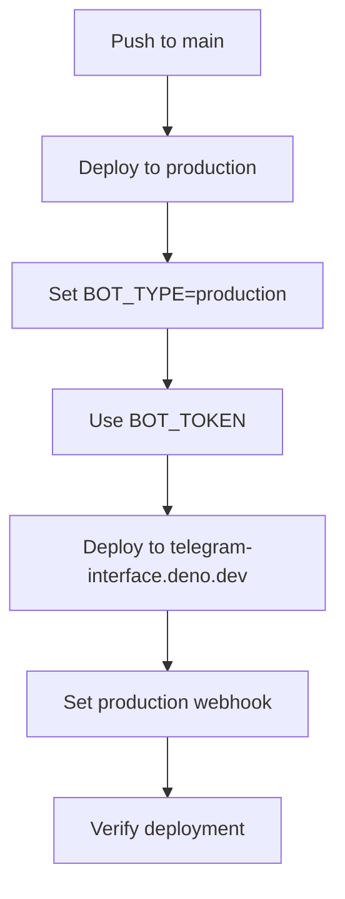
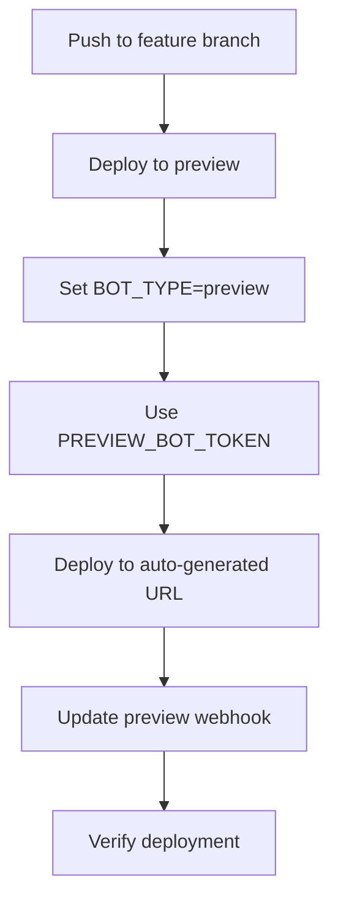

# GitHub Actions CI/CD Workflows

This directory contains the GitHub Actions workflows that orchestrate the dual bot deployment system for the Telegram Interface project.

## Overview

The CI/CD system supports a dual deployment strategy:
- **Production Bot**: Deployed to `https://telegram-interface.deno.dev` on main branch pushes
- **Preview Bot**: Deployed to auto-generated preview URLs on feature branch pushes

## Workflows

### 1. [`deploy.yml`](.github/workflows/deploy.yml) - Main Deployment Workflow

**Triggers:**
- Push to any branch
- Pull requests to main branch

**Behavior:**
- **Main branch**: Production deployment with production bot token and webhook
- **Other branches**: Preview deployment with preview bot token and webhook

**Key Features:**
- Automatic bot type detection based on branch
- Environment variable injection per deployment type
- Webhook configuration using existing scripts
- Deployment verification and status reporting

### 2. [`cleanup-preview.yml`](.github/workflows/cleanup-preview.yml) - Preview Cleanup

**Triggers:**
- Pull request closed/merged

**Behavior:**
- Removes webhook from preview bot when PR is closed
- Logs cleanup summary
- Prevents orphaned webhooks pointing to closed deployments

### 3. [`test-deployment.yml`](.github/workflows/test-deployment.yml) - System Testing

**Triggers:**
- Manual workflow dispatch

**Test Types:**
- `webhook-check`: Verify current webhook status for both bots
- `config-test`: Test configuration system with both bot types
- `api-connectivity`: Test API connections (Deno Deploy, Telegram)

## Required Environment Variables

Configure these secrets in your GitHub repository settings:

### Bot Tokens
- `BOT_TOKEN` - Production Telegram bot token
- `PREVIEW_BOT_TOKEN` - Preview Telegram bot token

### Webhook Secrets
- `WEBHOOK_SECRET_PRODUCTION` - Production webhook secret
- `WEBHOOK_SECRET_PREVIEW` - Preview webhook secret

### API Keys
- `OPENROUTER_API_KEY` - OpenRouter API key for AI responses
- `DENO_DEPLOY_TOKEN` - Deno Deploy API token for deployment management

## Deployment Flow

### Production Deployment (Main Branch)


### Preview Deployment (Feature Branch)


## Usage Examples

### Triggering Deployments

**Production Deployment:**
```bash
git push origin main
```

**Preview Deployment:**
```bash
git checkout -b feature/new-feature
git push origin feature/new-feature
```

### Running Tests

1. Go to GitHub Actions tab
2. Select "Test Deployment System"
3. Click "Run workflow"
4. Choose test type and run

### Monitoring Deployments

Check the Actions tab for:
- Deployment status and logs
- Webhook configuration results
- Error messages and troubleshooting info

## Troubleshooting

### Common Issues

**Webhook Configuration Fails:**
- Verify bot tokens are correct
- Check webhook secrets are properly set
- Ensure Deno Deploy token has proper permissions

**Deployment Fails:**
- Check Deno Deploy project exists
- Verify environment variables are set
- Review deployment logs for specific errors

**Preview Bot Not Working:**
- Ensure PREVIEW_BOT_TOKEN is different from production
- Check that preview webhook is updated after deployment
- Verify preview bot is configured correctly in Telegram

### Manual Intervention

If automated webhook setup fails, you can manually set webhooks:

```bash
# Set production webhook
bun run scripts/set-webhook.ts --bot-type production

# Set preview webhook  
bun run scripts/set-webhook.ts --bot-type preview

# Check webhook status
bun run scripts/check-webhook.ts --bot-type production
bun run scripts/check-webhook.ts --bot-type preview
```

## Architecture Integration

These workflows integrate with:
- [`src/utils/config.ts`](../../src/utils/config.ts) - Dual bot configuration system
- [`scripts/deno-deploy-api.ts`](../../scripts/deno-deploy-api.ts) - Deno Deploy API integration
- [`scripts/set-webhook.ts`](../../scripts/set-webhook.ts) - Production webhook management
- [`scripts/update-preview-webhook.ts`](../../scripts/update-preview-webhook.ts) - Preview webhook management
- [`scripts/check-webhook.ts`](../../scripts/check-webhook.ts) - Webhook verification

## Security Considerations

- All sensitive tokens stored as GitHub Secrets
- Webhook secrets used for URL path security
- Bot tokens separated by environment (production/preview)
- No secrets exposed in logs or public outputs

## Best Practices

1. **Test with Preview**: Always test changes on feature branches before merging
2. **Monitor Logs**: Check deployment logs for warnings or errors
3. **Verify Webhooks**: Use test workflow to verify webhook configuration
4. **Clean Branches**: Delete feature branches after merging to trigger cleanup
5. **Environment Separation**: Keep production and preview bot tokens completely separate