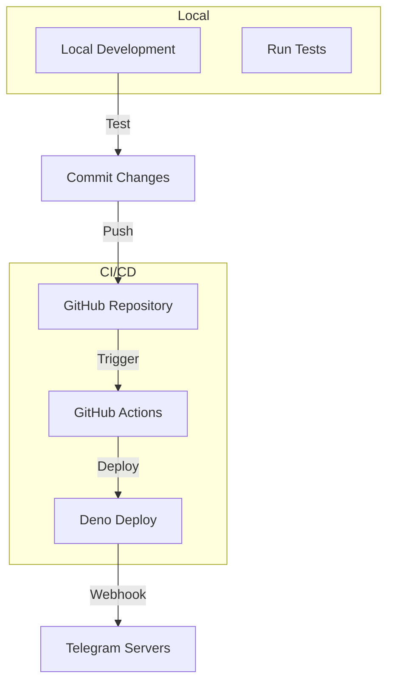

# Telegram Bot Implementation Plan

## Quick Start Guide

### Prerequisites
- Deno installed locally (latest version)
- GitHub account (for Deno Deploy)
- Telegram Bot Token: `<your-bot-token-from-botfather>`

### Step-by-Step Implementation

## Phase 1: Project Setup (30 minutes)

### 1.1 Initialize Project Structure

```bash
# Create project directory
mkdir telegram-interface
cd telegram-interface

# Create directory structure
mkdir -p src/handlers src/middleware src/utils tests
```

### 1.2 Create Core Configuration Files

**deno.json:**
```json
{
  "tasks": {
    "dev": "deno run --watch --allow-net --allow-env --allow-read src/main.ts",
    "test": "deno test --allow-net --allow-env",
    "fmt": "deno fmt",
    "lint": "deno lint"
  },
  "imports": {
    "grammy": "https://deno.land/x/grammy@v1.21.1/mod.ts",
    "grammy/types": "https://deno.land/x/grammy@v1.21.1/types.ts",
    "std/": "https://deno.land/std@0.213.0/"
  }
}
```

**.env.example:**
```bash
BOT_TOKEN=your_bot_token_here
WEBHOOK_SECRET=generate_random_string_here
LOG_LEVEL=info
ENVIRONMENT=development
```

**.gitignore:**
```
.env
.env.local
*.log
.DS_Store
```

## Phase 2: Core Implementation (1 hour)

### 2.1 Configuration Management

**src/utils/config.ts:**
```typescript
export interface Config {
  botToken: string;
  webhookSecret: string;
  logLevel: "debug" | "info" | "error";
  environment: "development" | "production";
}

export function getConfig(): Config {
  const botToken = Deno.env.get("BOT_TOKEN");
  if (!botToken) {
    throw new Error("BOT_TOKEN is required");
  }

  return {
    botToken,
    webhookSecret: Deno.env.get("WEBHOOK_SECRET") || crypto.randomUUID(),
    logLevel: (Deno.env.get("LOG_LEVEL") || "info") as Config["logLevel"],
    environment: (Deno.env.get("ENVIRONMENT") || "development") as Config["environment"],
  };
}
```

### 2.2 Bot Initialization

**src/bot.ts:**
```typescript
import { Bot } from "grammy";
import { getConfig } from "./utils/config.ts";
import { messageHandler } from "./handlers/message.ts";
import { loggerMiddleware } from "./middleware/logger.ts";

export function createBot() {
  const config = getConfig();
  const bot = new Bot(config.botToken);

  // Middleware
  bot.use(loggerMiddleware);

  // Handlers
  bot.on("message", messageHandler);

  return bot;
}
```

### 2.3 Message Handler

**src/handlers/message.ts:**
```typescript
import { Context } from "grammy";

export async function messageHandler(ctx: Context) {
  try {
    await ctx.reply("ok");
  } catch (error) {
    console.error("Failed to send reply:", error);
  }
}
```

### 2.4 Logger Middleware

**src/middleware/logger.ts:**
```typescript
import { Context, NextFunction } from "grammy";

export async function loggerMiddleware(ctx: Context, next: NextFunction) {
  const startTime = Date.now();
  
  console.log({
    type: "request",
    update_id: ctx.update.update_id,
    from: ctx.from?.id,
    chat: ctx.chat?.id,
    timestamp: new Date().toISOString(),
  });

  await next();

  console.log({
    type: "response",
    update_id: ctx.update.update_id,
    duration_ms: Date.now() - startTime,
  });
}
```

### 2.5 Main Entry Point

**src/main.ts:**
```typescript
import { webhookCallback } from "grammy";
import { createBot } from "./bot.ts";
import { getConfig } from "./utils/config.ts";

const bot = createBot();
const config = getConfig();

// Create webhook handler
const handleUpdate = webhookCallback(bot, "std/http");

Deno.serve({
  port: 8000,
  onListen: ({ hostname, port }) => {
    console.log(`Webhook server running at http://${hostname}:${port}`);
    console.log(`Webhook path: /webhook/${config.webhookSecret}`);
  },
}, async (req) => {
  const url = new URL(req.url);

  // Health check endpoint
  if (url.pathname === "/health" && req.method === "GET") {
    return new Response(JSON.stringify({ 
      status: "ok", 
      timestamp: new Date().toISOString() 
    }), {
      headers: { "Content-Type": "application/json" },
    });
  }

  // Webhook endpoint
  if (url.pathname === `/webhook/${config.webhookSecret}` && req.method === "POST") {
    try {
      return await handleUpdate(req);
    } catch (error) {
      console.error("Webhook error:", error);
      return new Response("Internal Server Error", { status: 500 });
    }
  }

  // 404 for all other routes
  return new Response("Not Found", { status: 404 });
});
```

## Phase 3: Deployment Setup (30 minutes)

### 3.1 GitHub Actions Workflow

**.github/workflows/deploy.yml:**
```yaml
name: Deploy to Deno Deploy

on:
  push:
    branches: [main]
  pull_request:
    branches: [main]

jobs:
  deploy:
    runs-on: ubuntu-latest
    permissions:
      id-token: write
      contents: read

    steps:
      - uses: actions/checkout@v3
      
      - name: Deploy to Deno Deploy
        uses: denoland/deployctl@v1
        with:
          project: telegram-interface
          entrypoint: src/main.ts
```

### 3.2 Local Development Script

**scripts/dev.ts:**
```typescript
import { createBot } from "../src/bot.ts";

const bot = createBot();

// For local development, use long polling
console.log("Starting bot in development mode...");
bot.start({
  onStart: () => console.log("Bot is running!"),
});
```

### 3.3 Webhook Setup Script

**scripts/set-webhook.ts:**
```typescript
import { getConfig } from "../src/utils/config.ts";

const config = getConfig();
const baseUrl = Deno.env.get("WEBHOOK_URL") || "https://your-project.deno.dev";
const webhookUrl = `${baseUrl}/webhook/${config.webhookSecret}`;

const response = await fetch(
  `https://api.telegram.org/bot${config.botToken}/setWebhook`,
  {
    method: "POST",
    headers: { "Content-Type": "application/json" },
    body: JSON.stringify({
      url: webhookUrl,
      drop_pending_updates: true,
    }),
  }
);

const result = await response.json();
console.log("Webhook setup result:", result);
```

## Phase 4: Testing (30 minutes)

### 4.1 Basic Test Suite

**tests/bot.test.ts:**
```typescript
import { assertEquals } from "std/assert/mod.ts";
import { createBot } from "../src/bot.ts";

Deno.test("Bot creation", () => {
  const bot = createBot();
  assertEquals(typeof bot.handleUpdate, "function");
});

Deno.test("Config validation", () => {
  // Mock environment
  Deno.env.set("BOT_TOKEN", "test-token");
  
  const { getConfig } = await import("../src/utils/config.ts");
  const config = getConfig();
  
  assertEquals(config.botToken, "test-token");
  assertEquals(config.environment, "development");
});
```

## Deployment Checklist

### Pre-Deployment
- [ ] Create `.env` file from `.env.example`
- [ ] Add bot token to `.env`
- [ ] Generate webhook secret
- [ ] Test locally with `deno task dev`
- [ ] Run tests with `deno task test`

### Deno Deploy Setup
1. [ ] Create account at https://deno.com/deploy
2. [ ] Create new project
3. [ ] Link GitHub repository
4. [ ] Set environment variables:
   - `BOT_TOKEN`
   - `WEBHOOK_SECRET`
   - `LOG_LEVEL`
   - `ENVIRONMENT`

### Post-Deployment
1. [ ] Get deployment URL
2. [ ] Run webhook setup script
3. [ ] Test bot in Telegram
4. [ ] Monitor logs in Deno Deploy dashboard

## Security Checklist

### Token Protection
- [ ] Bot token only in environment variables
- [ ] Never logged or exposed in errors
- [ ] `.env` file in `.gitignore`

### Webhook Security
- [ ] Random webhook secret generated
- [ ] HTTPS enforced by Deno Deploy
- [ ] Request validation implemented

### Error Handling
- [ ] All errors caught and logged
- [ ] No sensitive data in error messages
- [ ] Graceful degradation

## Development Workflow



## Common Commands

```bash
# Development
deno task dev           # Run with file watching
deno task test          # Run tests
deno task fmt           # Format code
deno task lint          # Lint code

# Deployment
git push origin main    # Trigger deployment

# Webhook Management
deno run --allow-net --allow-env scripts/set-webhook.ts
```

## Troubleshooting Guide

### Bot Not Responding
1. Check Deno Deploy logs
2. Verify webhook is set correctly
3. Ensure bot token is valid
4. Check environment variables

### Deployment Fails
1. Verify GitHub Actions permissions
2. Check Deno Deploy project settings
3. Ensure valid TypeScript syntax
4. Review deployment logs

### Local Development Issues
1. Ensure Deno is installed
2. Check `.env` file exists
3. Verify network permissions
4. Use correct Deno version

## Next Steps

Once the MVP is deployed and working:

1. **Add Commands:**
   - Implement command handlers
   - Add help command
   - Create admin commands

2. **Enhance Security:**
   - Add rate limiting
   - Implement user authentication
   - Add request signing

3. **Improve Monitoring:**
   - Add structured logging
   - Implement metrics collection
   - Set up alerts

4. **Scale Features:**
   - Add Deno KV for state
   - Implement user preferences
   - Add webhook queue

This implementation plan provides a complete roadmap from zero to a deployed Telegram bot on Deno Deploy. The modular structure allows for easy expansion while maintaining the minimal "ok" response functionality as the core feature.