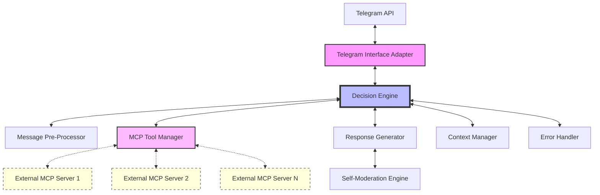
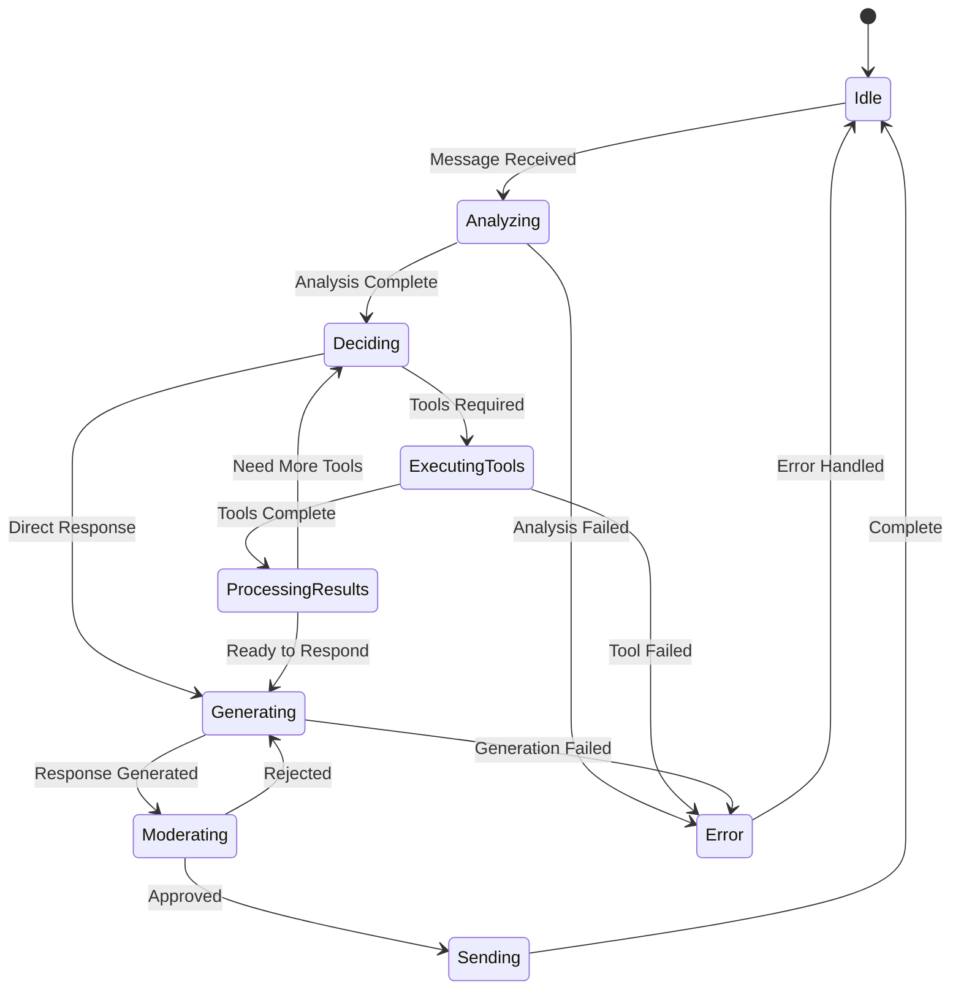
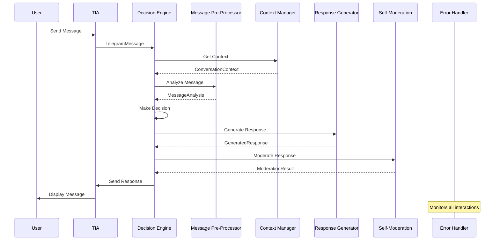
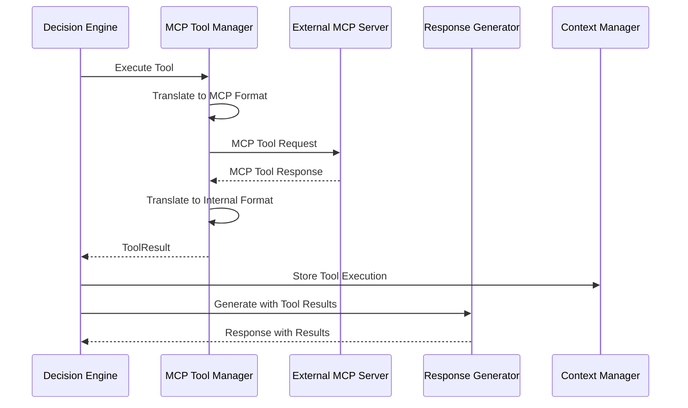
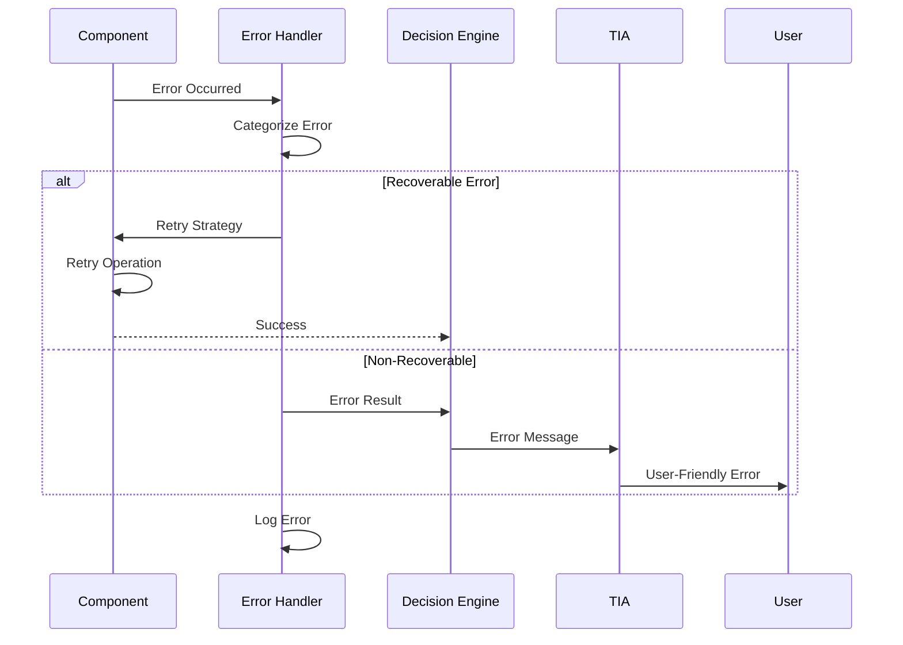

# New Architecture: Modular System with External MCP Integration

## Executive Summary

This document outlines the new architecture for the Telegram bot system, transitioning from an embedded MCP approach to a fully modular system where ALL MCP tools are external to the kernel. The architecture consists of 8 distinct components that communicate through well-defined interfaces, ensuring separation of concerns and maintainability.

## Current State Analysis

### Problems with Current Architecture

1. **Embedded MCP Tools**: The `mcp-hub.ts` service is part of the kernel, violating the separation of concerns
2. **Tight Coupling**: Tool execution logic is intertwined with core bot functionality
3. **Mock Implementation**: Current MCP integration is simulated rather than using actual MCP protocol
4. **Monolithic Design**: All components are tightly coupled within a single service layer

## New Architecture Overview



## Component Specifications

### 1. Telegram Interface Adapter (TIA)

**Purpose**: Handles all Telegram-specific communication and protocol translation.

**Responsibilities**:
- Receive webhook updates from Telegram
- Parse Telegram message formats
- Handle inline keyboards and callback queries
- Send messages back to Telegram
- Manage rate limiting and Telegram API constraints

**Interfaces**:
```typescript
interface TelegramMessage {
  chatId: number;
  userId: number;
  messageId: number;
  text?: string;
  callbackData?: string;
  timestamp: Date;
}

interface TelegramResponse {
  chatId: number;
  text: string;
  replyMarkup?: InlineKeyboard;
  parseMode?: 'Markdown' | 'HTML';
}

interface ITelegramInterfaceAdapter {
  receiveUpdate(update: TelegramUpdate): Promise<TelegramMessage>;
  sendResponse(response: TelegramResponse): Promise<void>;
  sendTypingIndicator(chatId: number): Promise<void>;
}
```

**Implementation Notes**:
- Uses Grammy library for Telegram bot API
- Maintains webhook security with secret validation
- Handles deduplication of updates
- No business logic, purely protocol translation

### 2. Message Pre-Processor (MPP)

**Purpose**: Analyzes incoming messages using LLM to understand intent and extract structured information.

**Responsibilities**:
- Classify message intent (question, command, tool request, etc.)
- Extract entities and parameters
- Determine if tools are needed
- Prepare structured data for Decision Engine

**Interfaces**:
```typescript
interface MessageAnalysis {
  intent: 'question' | 'command' | 'tool_request' | 'conversation';
  entities: Record<string, any>;
  suggestedTools?: string[];
  confidence: number;
  requiresContext: boolean;
}

interface IMessagePreProcessor {
  analyzeMessage(
    message: string,
    context?: ConversationContext
  ): Promise<MessageAnalysis>;
}
```

**Implementation Notes**:
- Uses OpenRouter API for LLM analysis
- Maintains a specialized prompt for intent classification
- Caches analysis results for similar messages
- Operates independently of tool execution

### 3. Decision Engine (DE)

**Purpose**: Central orchestrator that coordinates all components and makes routing decisions.

**Responsibilities**:
- Receive processed messages from MPP
- Decide which components to invoke
- Coordinate tool execution through MTM
- Manage conversation flow
- Handle multi-step interactions

**Interfaces**:
```typescript
interface DecisionContext {
  message: TelegramMessage;
  analysis: MessageAnalysis;
  conversationState: ConversationContext;
  availableTools: ToolDefinition[];
}

interface Decision {
  action: 'respond' | 'execute_tools' | 'ask_clarification' | 'error';
  toolCalls?: ToolCall[];
  responseStrategy?: ResponseStrategy;
  metadata: Record<string, any>;
}

interface IDecisionEngine {
  makeDecision(context: DecisionContext): Promise<Decision>;
  processToolResults(results: ToolResult[]): Promise<Decision>;
  handleError(error: Error, context: DecisionContext): Promise<Decision>;
}
```

**State Machine**:


### 4. MCP Tool Manager (MTM)

**Purpose**: Manages connections to external MCP servers and handles all tool-related operations.

**Responsibilities**:
- Discover available tools from external MCP servers
- Translate between internal tool format and MCP protocol
- Execute tools on external servers
- Handle MCP server lifecycle (connect/disconnect)
- Manage tool result formatting

**Interfaces**:
```typescript
interface MCPServerConfig {
  name: string;
  command: string;
  args: string[];
  env?: Record<string, string>;
  transport: 'stdio' | 'http';
}

interface ToolDefinition {
  serverId: string;
  name: string;
  description: string;
  inputSchema: any;
  outputSchema?: any;
}

interface ToolCall {
  toolId: string;
  serverId: string;
  arguments: Record<string, any>;
}

interface ToolResult {
  toolId: string;
  success: boolean;
  output?: any;
  error?: string;
}

interface IMCPToolManager {
  // Lifecycle
  initialize(configs: MCPServerConfig[]): Promise<void>;
  shutdown(): Promise<void>;

  // Discovery
  getAvailableTools(): Promise<ToolDefinition[]>;
  getToolDefinition(toolId: string): Promise<ToolDefinition | null>;

  // Execution
  executeTool(call: ToolCall): Promise<ToolResult>;
  executeMultipleTools(calls: ToolCall[]): Promise<ToolResult[]>;

  // Health
  getServerStatus(serverId: string): Promise<ServerStatus>;
}
```

**MCP Protocol Handling**:
```typescript
// Internal format to MCP format translation
interface MCPToolRequest {
  jsonrpc: "2.0";
  method: "tools/call";
  params: {
    name: string;
    arguments: any;
  };
  id: string;
}

// MCP response to internal format translation
interface MCPToolResponse {
  jsonrpc: "2.0";
  result?: {
    content: Array<{
      type: "text" | "image" | "resource";
      text?: string;
      data?: any;
    }>;
  };
  error?: {
    code: number;
    message: string;
  };
  id: string;
}
```

### 5. Response Generator (RG)

**Purpose**: Constructs appropriate responses using LLM with context and tool results.

**Responsibilities**:
- Generate natural language responses
- Incorporate tool results into responses
- Format responses for Telegram (markdown, inline keyboards)
- Handle response length constraints

**Interfaces**:
```typescript
interface ResponseContext {
  originalMessage: string;
  analysis: MessageAnalysis;
  toolResults?: ToolResult[];
  conversationHistory: Message[];
  constraints: ResponseConstraints;
}

interface ResponseConstraints {
  maxLength: number;
  allowMarkdown: boolean;
  requireInlineKeyboard: boolean;
  tone?: 'formal' | 'casual' | 'technical';
}

interface GeneratedResponse {
  text: string;
  inlineKeyboard?: InlineKeyboard;
  metadata: {
    tokensUsed: number;
    model: string;
    generationTime: number;
  };
}

interface IResponseGenerator {
  generateResponse(context: ResponseContext): Promise<GeneratedResponse>;
  formatToolResults(results: ToolResult[]): string;
  createInlineKeyboard(options: string[]): InlineKeyboard;
}
```

### 6. Self-Moderation Engine (SME)

**Purpose**: Validates all responses before sending to ensure quality and safety.

**Responsibilities**:
- Check response relevance and coherence
- Ensure response follows guidelines
- Validate tool result integration
- Flag potentially problematic content

**Interfaces**:
```typescript
interface ModerationResult {
  approved: boolean;
  issues?: ModerationIssue[];
  suggestions?: string[];
  confidence: number;
}

interface ModerationIssue {
  type: 'relevance' | 'safety' | 'format' | 'coherence';
  severity: 'low' | 'medium' | 'high';
  description: string;
}

interface ISelfModerationEngine {
  moderateResponse(
    response: GeneratedResponse,
    context: ResponseContext
  ): Promise<ModerationResult>;

  validateToolIntegration(
    response: string,
    toolResults: ToolResult[]
  ): Promise<boolean>;
}
```

### 7. Context Manager (CM)

**Purpose**: Manages conversation state and history across all interactions.

**Responsibilities**:
- Store and retrieve conversation history
- Manage context windows for LLM
- Track tool execution history
- Handle context cleanup and expiration

**Interfaces**:
```typescript
interface ConversationContext {
  chatId: number;
  messages: Message[];
  toolExecutions: ToolExecution[];
  metadata: {
    startTime: Date;
    lastActivity: Date;
    messageCount: number;
    tokenCount: number;
  };
}

interface Message {
  role: 'user' | 'assistant' | 'system' | 'tool';
  content: string;
  timestamp: Date;
  metadata?: Record<string, any>;
}

interface ToolExecution {
  toolId: string;
  timestamp: Date;
  input: any;
  output: any;
  success: boolean;
}

interface IContextManager {
  // Context operations
  getContext(chatId: number): Promise<ConversationContext>;
  addMessage(chatId: number, message: Message): Promise<void>;
  addToolExecution(chatId: number, execution: ToolExecution): Promise<void>;

  // Context window management
  buildContextWindow(
    chatId: number,
    maxTokens: number
  ): Promise<Message[]>;

  // Cleanup
  cleanupOldContexts(maxAge: number): Promise<void>;
}
```

### 8. Error Handler (EH)

**Purpose**: Centralized error handling and recovery strategies.

**Responsibilities**:
- Catch and categorize errors from all components
- Implement retry strategies
- Generate user-friendly error messages
- Log errors for monitoring

**Interfaces**:
```typescript
interface ErrorContext {
  component: string;
  operation: string;
  originalError: Error;
  metadata: Record<string, any>;
}

interface ErrorHandlingResult {
  handled: boolean;
  retry: boolean;
  userMessage?: string;
  logLevel: 'debug' | 'info' | 'warn' | 'error';
}

interface IErrorHandler {
  handleError(context: ErrorContext): Promise<ErrorHandlingResult>;

  // Specific error handlers
  handleMCPError(error: Error, serverId: string): Promise<ErrorHandlingResult>;
  handleLLMError(error: Error, model: string): Promise<ErrorHandlingResult>;
  handleTelegramError(error: Error): Promise<ErrorHandlingResult>;
}
```

**Error Categories**:
```typescript
enum ErrorCategory {
  // Recoverable errors
  NETWORK_TIMEOUT = 'network_timeout',
  RATE_LIMIT = 'rate_limit',
  TEMPORARY_FAILURE = 'temporary_failure',

  // Tool errors
  MCP_SERVER_UNAVAILABLE = 'mcp_server_unavailable',
  TOOL_EXECUTION_FAILED = 'tool_execution_failed',
  INVALID_TOOL_ARGS = 'invalid_tool_args',

  // System errors
  INVALID_CONFIG = 'invalid_config',
  RESOURCE_EXHAUSTED = 'resource_exhausted',
  INTERNAL_ERROR = 'internal_error',
}
```

## Data Flow Diagrams

### Standard Message Flow



### Tool Execution Flow



### Error Recovery Flow



## Interface Contracts

### Message Formats

**Internal Message Format**:
```typescript
interface InternalMessage {
  id: string;
  source: 'telegram' | 'test' | 'api';
  content: {
    text?: string;
    data?: any;
  };
  metadata: {
    chatId: number;
    userId: number;
    timestamp: Date;
    [key: string]: any;
  };
}
```

**Tool Communication Format**:
```typescript
interface ToolCommunication {
  // Request from DE to MTM
  request: {
    id: string;
    toolId: string;
    serverId: string;
    arguments: any;
    timeout?: number;
  };

  // Response from MTM to DE
  response: {
    id: string;
    success: boolean;
    result?: any;
    error?: {
      code: string;
      message: string;
      details?: any;
    };
    executionTime: number;
  };
}
```

### Event System

```typescript
// Component events for loose coupling
interface SystemEvent {
  type: string;
  source: string;
  timestamp: Date;
  data: any;
}

// Event types
enum EventType {
  // Lifecycle events
  COMPONENT_READY = 'component.ready',
  COMPONENT_ERROR = 'component.error',

  // Message events
  MESSAGE_RECEIVED = 'message.received',
  MESSAGE_PROCESSED = 'message.processed',

  // Tool events
  TOOL_EXECUTION_START = 'tool.execution.start',
  TOOL_EXECUTION_END = 'tool.execution.end',

  // System events
  CONTEXT_OVERFLOW = 'context.overflow',
  RATE_LIMIT_HIT = 'rate_limit.hit',
}
```

## Error Handling Strategies

### 1. Retry Strategies

```typescript
interface RetryStrategy {
  maxAttempts: number;
  backoffType: 'exponential' | 'linear' | 'fixed';
  initialDelay: number;
  maxDelay: number;
  retryableErrors: ErrorCategory[];
}

// Component-specific strategies
const strategies: Record<string, RetryStrategy> = {
  mcp_tool_execution: {
    maxAttempts: 3,
    backoffType: 'exponential',
    initialDelay: 1000,
    maxDelay: 10000,
    retryableErrors: [
      ErrorCategory.NETWORK_TIMEOUT,
      ErrorCategory.TEMPORARY_FAILURE,
    ],
  },
  llm_api_call: {
    maxAttempts: 2,
    backoffType: 'fixed',
    initialDelay: 2000,
    maxDelay: 2000,
    retryableErrors: [
      ErrorCategory.RATE_LIMIT,
      ErrorCategory.NETWORK_TIMEOUT,
    ],
  },
};
```

### 2. Graceful Degradation

When MCP tools are unavailable:
1. Inform user that advanced features are temporarily unavailable
2. Fall back to basic LLM responses without tool integration
3. Queue tool requests for when servers recover
4. Provide alternative suggestions

### 3. Circuit Breaker Pattern

```typescript
interface CircuitBreaker {
  serverId: string;
  state: 'closed' | 'open' | 'half-open';
  failureCount: number;
  lastFailureTime: Date;
  nextRetryTime: Date;
}

// Prevent cascading failures
class CircuitBreakerManager {
  private breakers: Map<string, CircuitBreaker>;

  shouldAllowRequest(serverId: string): boolean {
    const breaker = this.breakers.get(serverId);
    if (!breaker) return true;

    if (breaker.state === 'open' && Date.now() > breaker.nextRetryTime.getTime()) {
      breaker.state = 'half-open';
    }

    return breaker.state !== 'open';
  }
}
```

## Migration Plan

### Phase 1: Component Extraction (Week 1)

1. **Extract TIA**:
   - Move Telegram-specific code from `src/handlers/*` and `src/bot.ts`
   - Create clean interface for telegram communication
   - Maintain backward compatibility

2. **Extract CM**:
   - Move conversation history logic from `src/services/conversation-history.ts`
   - Create abstract storage interface
   - Implement Deno KV backend

3. **Extract EH**:
   - Centralize error handling from various services
   - Create error categorization system

### Phase 2: Core Components (Week 2)

1. **Create DE**:
   - Build central orchestrator
   - Implement state machine
   - Connect to extracted components

2. **Create MPP**:
   - Extract message analysis logic
   - Build intent classification system

3. **Create RG**:
   - Extract response generation from `src/services/get-ai-response.ts`
   - Separate from tool execution logic

### Phase 3: MCP Externalization (Week 3)

1. **Create MTM**:
   - Build new MCP protocol handler
   - Implement stdio/HTTP transports
   - Create tool discovery system

2. **Remove embedded MCP**:
   - Delete `src/services/mcp-hub.ts`
   - Update tool execution flow
   - Migrate tool definitions

3. **Test external MCP servers**:
   - Create example MCP servers
   - Test tool discovery and execution
   - Validate error handling

### Phase 4: Final Integration (Week 4)

1. **Create SME**:
   - Implement response validation
   - Build moderation rules

2. **Integration testing**:
   - Test all components together
   - Validate data flows
   - Performance testing

3. **Migration completion**:
   - Update deployment scripts
   - Update documentation
   - Deprecate old components

### Rollback Strategy

Each phase includes rollback points:
- Feature flags for new components
- Parallel running of old and new systems
- Gradual traffic migration
- Automated rollback on error thresholds

## Configuration Schema

```yaml
# config.yaml
system:
  environment: production
  logLevel: info

components:
  tia:
    telegram:
      token: ${TELEGRAM_BOT_TOKEN}
      webhookSecret: ${WEBHOOK_SECRET}
      maxMessageLength: 4096

  mpp:
    llm:
      provider: openrouter
      model: deepseek/deepseek-r1
      maxTokens: 1000

  de:
    maxToolIterations: 5
    decisionTimeout: 30000

  mtm:
    servers:
      - name: weather
        command: npx
        args: ["@example/mcp-weather"]
        transport: stdio
        env:
          API_KEY: ${WEATHER_API_KEY}
      - name: github
        command: npx
        args: ["@modelcontextprotocol/server-github"]
        transport: stdio
        env:
          GITHUB_TOKEN: ${GITHUB_TOKEN}

  rg:
    llm:
      provider: openrouter
      model: deepseek/deepseek-r1
      maxTokens: 4000
      temperature: 0.7

  sme:
    enabled: true
    strictMode: false
    maxRetries: 2

  cm:
    storage: deno-kv
    maxConversationAge: 86400000 # 24 hours
    maxMessagesPerChat: 1000

  eh:
    enableRetries: true
    enableCircuitBreaker: true
    errorReporting:
      enabled: true
      endpoint: ${ERROR_REPORTING_ENDPOINT}
```

## Monitoring and Observability

### Metrics to Track

```typescript
interface SystemMetrics {
  // Component health
  componentStatus: Record<string, 'healthy' | 'degraded' | 'unhealthy'>;

  // Performance metrics
  messageProcessingTime: Histogram;
  toolExecutionTime: Histogram;
  responseGenerationTime: Histogram;

  // Usage metrics
  messagesProcessed: Counter;
  toolsExecuted: Counter;
  errorsHandled: Counter;

  // Resource metrics
  activeConversations: Gauge;
  mcpServerConnections: Gauge;
  memoryUsage: Gauge;
}
```

### Logging Strategy

```typescript
// Structured logging with correlation IDs
interface LogEntry {
  timestamp: Date;
  level: 'debug' | 'info' | 'warn' | 'error';
  component: string;
  operation: string;
  correlationId: string;
  message: string;
  metadata?: Record<string, any>;
}

// Distributed tracing
interface TraceSpan {
  traceId: string;
  spanId: string;
  parentSpanId?: string;
  operation: string;
  startTime: Date;
  endTime?: Date;
  tags: Record<string, any>;
}
```

## Security Considerations

### 1. Component Isolation

- Each component runs with least required privileges
- No direct database access from external-facing components
- Validated interfaces between all components

### 2. MCP Security

- Sandboxed execution for MCP servers
- Capability-based permissions for tools
- Audit logging for all tool executions
- Input validation and sanitization

### 3. Data Protection

- Encryption in transit between components
- Conversation data encryption at rest
- PII redaction in logs
- Secure configuration management

## Performance Optimization

### 1. Caching Strategy

```typescript
interface CacheLayer {
  // Response cache for common queries
  responseCache: LRUCache<string, GeneratedResponse>;

  // Tool result cache for deterministic tools
  toolResultCache: TTLCache<string, ToolResult>;

  // Message analysis cache
  analysisCache: TTLCache<string, MessageAnalysis>;
}
```

### 2. Connection Pooling

- Maintain persistent connections to MCP servers
- Connection pool for LLM API calls
- Reuse Telegram client connections

### 3. Async Processing

- Non-blocking tool execution
- Parallel processing where possible
- Stream processing for large responses

## Testing Strategy

### 1. Unit Tests

Each component has isolated unit tests:
- Mock all external dependencies
- Test error conditions
- Validate interface contracts

### 2. Integration Tests

Test component interactions:
- DE coordination tests
- MTM and external MCP server tests
- End-to-end message flow tests

### 3. Contract Tests

Ensure interfaces remain stable:
- Schema validation
- Backward compatibility tests
- Version compatibility matrix

## Conclusion

This architecture provides:

1. **Clear Separation**: MCP tools are completely external to the kernel
2. **Modularity**: Each component has a single responsibility
3. **Scalability**: Components can be scaled independently
4. **Maintainability**: Clear interfaces and separation of concerns
5. **Reliability**: Comprehensive error handling and recovery
6. **Flexibility**: Easy to add new MCP servers or modify components

The migration plan ensures a smooth transition while maintaining service availability. The architecture is designed to handle growth and changing requirements while keeping the core system stable and performant.