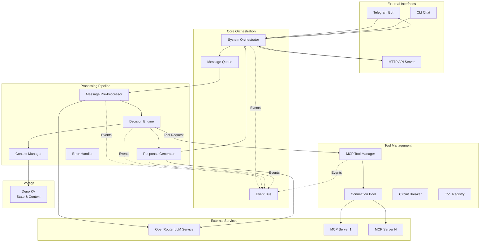

# Architecture Improvement Plan v2

## Current Architecture Overview



## Execution Plan

### Phase 1: Core System Improvements

#### 1.1 Simplify State Machine
**Files to modify**: `src/components/decision-engine/decision-engine.ts`, `src/components/decision-engine/state-machine.ts`

**Implementation**:
1. Reduce states to: `READY`, `PROCESSING`, `COMPLETED`, `ERROR`
2. Replace intermediate states with phase metadata:
   ```typescript
   interface ProcessingState {
     state: 'PROCESSING';
     phase: 'analysis' | 'decision' | 'tool_execution' | 'generation';
     metadata: Record<string, any>;
   }
   ```
3. Update state transitions to be phase-based rather than state-based
4. Simplify state persistence to store only essential data

#### 1.2 Centralize Error Recovery
**Files to create**: `src/services/error-recovery-service.ts`
**Files to modify**: All component files to use the new service

**Implementation**:
1. Create `ErrorRecoveryService` with:
   - Retry strategies (immediate, exponential backoff, linear backoff)
   - Error categorization (retryable/non-retryable)
   - Circuit breaker integration

2. Error categories:
   ```typescript
   enum ErrorCategory {
     NETWORK_ERROR,      // Retryable with backoff
     RATE_LIMIT,         // Retryable with exponential backoff
     INVALID_REQUEST,    // Non-retryable
     SERVICE_ERROR,      // Retryable with circuit breaker
     UNKNOWN            // Retryable once
   }
   ```

3. Update all components to use centralized error handling

### Phase 2: Enhanced Observability

#### 2.1 Structured Logging with OpenTelemetry
**Files to create**: `src/services/telemetry/telemetry-service.ts`
**Files to modify**: All components to use structured logging

**Implementation**:
1. Set up OpenTelemetry with file exporter:
   ```typescript
   // Export traces and logs to disk for LLM analysis
   const fileExporter = new FileSpanExporter({
     directory: './logs/traces',
     format: 'json',
     rotation: 'daily'
   });
   ```

2. Add correlation IDs to all requests:
   - Generate at entry point (System Orchestrator)
   - Pass through all components
   - Include in all log entries

3. Create structured log format:
   ```typescript
   interface StructuredLog {
     timestamp: string;
     correlationId: string;
     component: string;
     phase: string;
     level: 'DEBUG' | 'INFO' | 'WARN' | 'ERROR';
     message: string;
     metadata: Record<string, any>;
     duration?: number;
     error?: {
       type: string;
       message: string;
       stack: string;
     };
   }
   ```

4. Log key events:
   - Request start/end with duration
   - State transitions with metadata
   - LLM calls with prompts/responses
   - Tool executions with inputs/outputs
   - Errors with full context

#### 2.2 Debug Mode Enhancement
**Files to modify**: `src/utils/config.ts`, all component configurations

**Implementation**:
1. Add global debug flag that enables:
   - Verbose logging of all operations
   - Full prompt/response logging
   - Detailed state transition logs
   - Performance timing for each phase

2. Create debug log aggregator:
   ```typescript
   // Aggregate logs per request for easy analysis
   class DebugLogAggregator {
     aggregateByCorrelationId(correlationId: string): RequestDebugInfo;
     exportForLLMAnalysis(correlationId: string): string;
   }
   ```

### Phase 3: API Gateway Implementation

#### 3.1 Gateway Service
**Files to create**: `src/core/api-gateway.ts`
**Files to modify**: `src/main.ts` to route through gateway

**Implementation**:
1. Create gateway with middleware pipeline:
   ```typescript
   class ApiGateway {
     // Middleware pipeline
     private middlewares: Middleware[] = [
       rateLimitMiddleware,
       authenticationMiddleware,
       validationMiddleware,
       transformationMiddleware,
       loggingMiddleware
     ];
   }
   ```

2. Rate limiting per user/channel:
   ```typescript
   interface RateLimitConfig {
     windowMs: number;        // 60000 (1 minute)
     maxRequests: number;     // 10 requests per window
     keyGenerator: (req) => string; // userId + chatId
   }
   ```

3. Request transformation:
   - Normalize input formats across interfaces
   - Add metadata (timestamp, source interface, version)
   - Validate required fields

#### 3.2 Request Queue Management
**Files to modify**: `src/services/message-queue/message-queue.ts`

**Implementation**:
1. Move queue management to gateway level
2. Add priority based on:
   - Request type (commands > queries > conversations)
   - Request age (prevent starvation)

3. Add queue introspection for debugging:
   ```typescript
   interface QueueStats {
     depth: number;
     oldestMessage: Date;
     priorityDistribution: Record<string, number>;
     averageWaitTime: number;
   }
   ```

### Phase 4: Tool Management (Deprioritized)

#### 4.1 Tool Registry Improvements
**Files to modify**: `src/components/mcp-tool-manager/tool-registry.ts`

**Implementation**:
1. Add tool versioning support
2. Implement tool health checks
3. Add periodic refresh mechanism (configurable)

#### 4.2 Dynamic Tool Discovery
**Files to create**: `src/services/tool-discovery-service.ts`

**Implementation**:
1. Polling-based discovery with configurable intervals
2. Tool change events for real-time updates
3. Tool availability monitoring

## Implementation Order

1. **Week 1**: Phase 1 (Core System Improvements)
   - Day 1-2: Simplify state machine
   - Day 3-5: Centralize error recovery

2. **Week 2**: Phase 2 (Enhanced Observability)
   - Day 1-3: Implement OpenTelemetry with file exports
   - Day 4-5: Add debug mode enhancements

3. **Week 3**: Phase 3 (API Gateway)
   - Day 1-3: Build gateway service
   - Day 4-5: Integrate with existing interfaces

4. **Future**: Phase 4 (Tool Management)
   - Implement when core system is stable

## Testing Strategy

### Direct Implementation Tests
- Test each new component as it's built
- Use real services and integrations
- Focus on actual behavior verification

### Integration Tests
- Test complete message flow
- Verify state transitions
- Check error recovery mechanisms

### Debug Log Tests
- Verify correlation ID propagation
- Check log completeness for LLM analysis
- Test log rotation and cleanup
