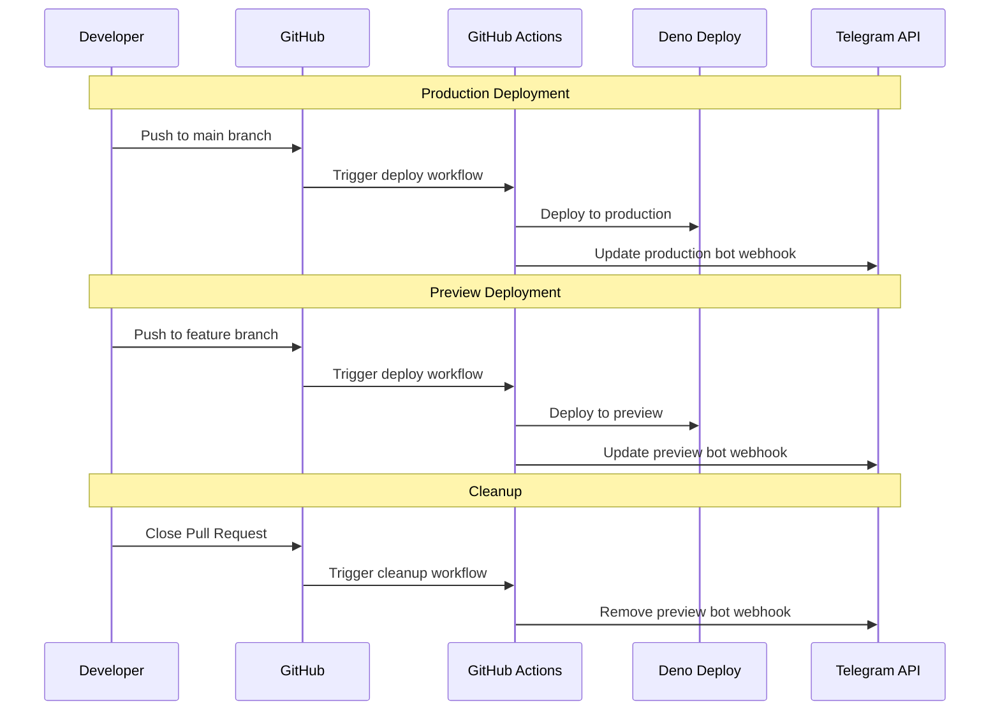

# Dual Deployment Architecture

## Overview

The Telegram interface implements a sophisticated dual deployment system that supports both production and preview environments with separate bot instances. This architecture enables safe testing of changes through preview deployments while maintaining a stable production environment.

## System Architecture

```mermaid
flowchart TD
    A[GitHub Repository] --> B{Branch Type}
    
    B -->|main branch| C[Production Deployment]
    B -->|feature branch| D[Preview Deployment]
    
    C --> E[Production Bot]
    D --> F[Preview Bot]
    
    E --> G[https://telegram-interface.deno.dev]
    F --> H[https://telegram-interface-{hash}.deno.dev]
    
    G --> I[Production Webhook]
    H --> J[Preview Webhook]
    
    I --> K[Production Telegram Bot]
    J --> L[Preview Telegram Bot]
    
    subgraph "Deno Deploy"
        C
        D
        G
        H
    end
    
    subgraph "Telegram API"
        K
        L
    end
```

## Deployment Flow

The system follows a branch-based deployment strategy:



### Production Flow
1. **Trigger**: Push to `main` branch
2. **Deployment**: Production deployment to `https://telegram-interface.deno.dev`
3. **Bot Configuration**: Uses `BOT_TOKEN` and `WEBHOOK_SECRET_PRODUCTION`
4. **Webhook**: [`scripts/set-webhook.ts`](../scripts/set-webhook.ts) sets production webhook

### Preview Flow
1. **Trigger**: Push to any non-main branch
2. **Deployment**: Preview deployment to `https://telegram-interface-{hash}.deno.dev`
3. **Bot Configuration**: Uses `PREVIEW_BOT_TOKEN` and `WEBHOOK_SECRET_PREVIEW`
4. **Webhook**: [`scripts/update-preview-webhook.ts`](../scripts/update-preview-webhook.ts) updates preview webhook

### Cleanup Flow
1. **Trigger**: Pull Request closure
2. **Action**: [`cleanup-preview.yml`](../.github/workflows/cleanup-preview.yml) removes preview webhook
3. **Result**: Preview bot disconnected from deployments

## Bot Configuration System

The dual bot system is controlled by the [`BOT_TYPE`](../src/utils/config.ts) environment variable:

### Configuration Logic

```typescript
// Production Configuration
BOT_TYPE=production
BOT_TOKEN=<production_bot_token>
WEBHOOK_SECRET_PRODUCTION=<production_webhook_secret>

// Preview Configuration  
BOT_TYPE=preview
PREVIEW_BOT_TOKEN=<preview_bot_token>
WEBHOOK_SECRET_PREVIEW=<preview_webhook_secret>
```

### Implementation Details

The [`src/utils/config.ts`](../src/utils/config.ts) file implements the configuration logic:

```typescript
const botType = (Deno.env.get("BOT_TYPE") || "production") as Config["botType"];

// Bot token selection
if (botType === "preview") {
  botToken = Deno.env.get("PREVIEW_BOT_TOKEN") || "";
} else {
  botToken = Deno.env.get("BOT_TOKEN") || "";
}

// Webhook secret selection
if (botType === "preview") {
  webhookSecret = Deno.env.get("WEBHOOK_SECRET_PREVIEW") || 
                 Deno.env.get("WEBHOOK_SECRET") || 
                 crypto.randomUUID();
} else {
  webhookSecret = Deno.env.get("WEBHOOK_SECRET_PRODUCTION") || 
                 Deno.env.get("WEBHOOK_SECRET") || 
                 crypto.randomUUID();
}
```

## Webhook Management

### URL Patterns

The system uses distinct URL patterns for webhook routing:

- **Production**: `https://telegram-interface.deno.dev/webhook/{WEBHOOK_SECRET_PRODUCTION}`
- **Preview**: `https://telegram-interface-{hash}.deno.dev/webhook/{WEBHOOK_SECRET_PREVIEW}`

### Webhook Scripts

#### Production Webhook Setup
[`scripts/set-webhook.ts`](../scripts/set-webhook.ts):
- Sets webhook for production bot
- Uses Deno Deploy API to get production URL
- Supports manual URL override

#### Preview Webhook Management
[`scripts/update-preview-webhook.ts`](../scripts/update-preview-webhook.ts):
- Automatically finds latest preview deployment
- Updates preview bot webhook to point to new deployment
- Verifies webhook configuration

#### Webhook Status Checking
[`scripts/check-webhook.ts`](../scripts/check-webhook.ts):
- Checks webhook status for both bots
- Displays configuration details
- Supports individual bot checking

## Deno Deploy API Integration

The [`scripts/deno-deploy-api.ts`](../scripts/deno-deploy-api.ts) module provides:

### Key Features
- **Project Information**: Get project details and deployment status
- **Deployment Discovery**: Find latest preview and production deployments
- **URL Resolution**: Generate correct URLs for webhook configuration

### API Methods
```typescript
class DenoDeployApi {
  async getProject(): Promise<DenoDeployProject>
  async getDeployments(): Promise<DenoDeploymentsResponse>
  async getLatestNonMainDeploymentUrl(): Promise<string | null>
  async getProductionDeploymentUrl(): Promise<string>
}
```

## GitHub Actions Workflows

### Main Deployment Workflow
[`.github/workflows/deploy.yml`](../.github/workflows/deploy.yml):

**Deployment Logic**:
```yaml
# Production (main branch)
if: github.ref == 'refs/heads/main'
  BOT_TYPE: production
  BOT_TOKEN: ${{ secrets.BOT_TOKEN }}
  WEBHOOK_SECRET: ${{ secrets.WEBHOOK_SECRET_PRODUCTION }}

# Preview (other branches)  
else:
  BOT_TYPE: preview
  BOT_TOKEN: ${{ secrets.PREVIEW_BOT_TOKEN }}
  WEBHOOK_SECRET: ${{ secrets.WEBHOOK_SECRET_PREVIEW }}
```

**Webhook Automation**:
- Production: Runs [`scripts/set-webhook.ts`](../scripts/set-webhook.ts) with `--bot-type production`
- Preview: Runs [`scripts/update-preview-webhook.ts`](../scripts/update-preview-webhook.ts)

### Cleanup Workflow
[`.github/workflows/cleanup-preview.yml`](../.github/workflows/cleanup-preview.yml):
- Triggered on PR closure
- Removes preview bot webhook
- Prevents orphaned webhooks

### Testing Workflow
[`.github/workflows/test-deployment.yml`](../.github/workflows/test-deployment.yml):
- Manual workflow dispatch
- Tests configuration system
- Verifies webhook status
- Checks API connectivity

## Security Model

### Token Isolation
- **Production Bot**: Uses `BOT_TOKEN` - production Telegram bot
- **Preview Bot**: Uses `PREVIEW_BOT_TOKEN` - separate test bot
- **Complete Isolation**: No shared credentials between environments

### Webhook Security
- **Separate Secrets**: `WEBHOOK_SECRET_PRODUCTION` vs `WEBHOOK_SECRET_PREVIEW`
- **Path-Based Routing**: Different webhook paths prevent cross-contamination
- **HTTPS Enforcement**: All webhooks use HTTPS endpoints

### Environment Variable Management
```bash
# Required for Production
BOT_TOKEN=<production_bot_token>
WEBHOOK_SECRET_PRODUCTION=<production_webhook_secret>

# Required for Preview  
PREVIEW_BOT_TOKEN=<preview_bot_token>
WEBHOOK_SECRET_PREVIEW=<preview_webhook_secret>

# Shared Configuration
OPENROUTER_API_KEY=<ai_service_key>
DENO_DEPLOY_TOKEN=<deployment_api_key>
```

## Component Integration

### Configuration Flow
1. **Environment Detection**: [`src/utils/config.ts`](../src/utils/config.ts) reads `BOT_TYPE`
2. **Token Selection**: Chooses appropriate bot token and webhook secret
3. **Webhook Registration**: Scripts use configuration to set correct webhooks

### Deployment Integration
1. **GitHub Actions**: Sets `BOT_TYPE` based on branch
2. **Deno Deploy**: Receives environment variables for bot configuration  
3. **Webhook Scripts**: Use Deno Deploy API to discover deployment URLs
4. **Telegram API**: Receives webhook registration with correct URLs

### Monitoring Integration
- **Health Checks**: Both deployments expose `/health` endpoints
- **Webhook Status**: [`scripts/check-webhook.ts`](../scripts/check-webhook.ts) monitors both bots
- **Deployment Logs**: Deno Deploy provides separate logs for each deployment

## Benefits

### Development Workflow
- **Safe Testing**: Preview deployments don't affect production
- **Isolated Changes**: Feature branches get their own bot instance
- **Automatic Cleanup**: PR closure removes preview resources

### Production Stability
- **Main Branch Protection**: Only tested changes reach production
- **Separate Bot Instances**: No risk of preview affecting production users
- **Rollback Capability**: Production remains stable during testing

### Operational Excellence
- **Automated Deployment**: No manual intervention required
- **Webhook Management**: Automatic webhook configuration
- **Status Monitoring**: Built-in health checking and status verification

This dual deployment architecture provides a robust foundation for safely developing and deploying Telegram bot features while maintaining production stability and operational excellence.