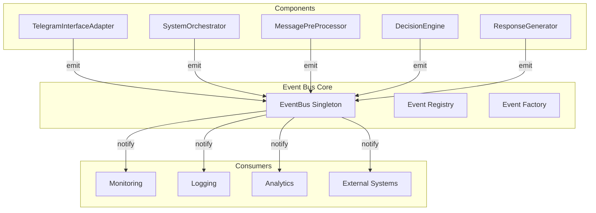
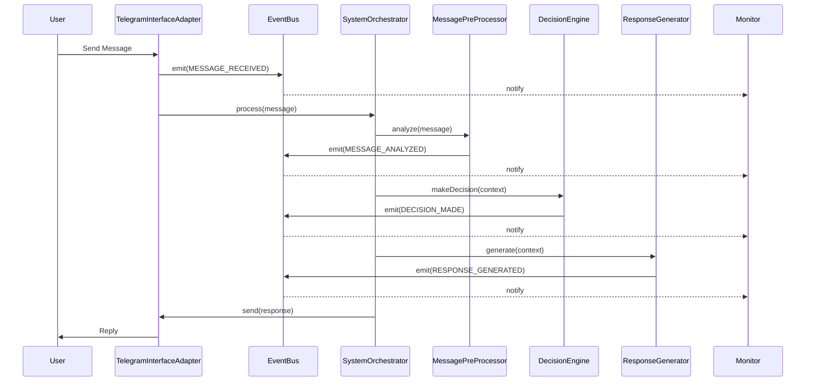

# Event Bus System Guide

## Overview

The Event Bus system provides a centralized publish-subscribe mechanism for component communication in the Telegram bot interface. It enables loose coupling between components while maintaining clear event flow and system observability.

## Architecture



## Event Types

### System Events

1. **COMPONENT_INITIALIZED** - Emitted when a component successfully initializes
   ```typescript
   {
     type: SystemEventType.COMPONENT_INITIALIZED,
     payload: {
       componentName: string,
       timestamp: Date
     }
   }
   ```

2. **COMPONENT_ERROR** - Emitted when a component encounters an error
   ```typescript
   {
     type: SystemEventType.COMPONENT_ERROR,
     payload: {
       componentName: string,
       error: Error
     },
     metadata?: any
   }
   ```

3. **SYSTEM_READY** - Emitted when all components are initialized
   ```typescript
   {
     type: SystemEventType.SYSTEM_READY,
     payload: {
       components: string[],
       timestamp: Date
     }
   }
   ```

### Message Processing Events

1. **MESSAGE_RECEIVED** - Emitted when a new message arrives
   ```typescript
   {
     type: SystemEventType.MESSAGE_RECEIVED,
     payload: {
       message: TelegramMessage,
       requestId: string
     }
   }
   ```

2. **MESSAGE_ANALYZED** - Emitted after message analysis
   ```typescript
   {
     type: SystemEventType.MESSAGE_ANALYZED,
     payload: {
       message: TelegramMessage,
       analysis: MessageAnalysis,
       requestId: string
     }
   }
   ```

3. **DECISION_MADE** - Emitted when a decision is made
   ```typescript
   {
     type: SystemEventType.DECISION_MADE,
     payload: {
       message: TelegramMessage,
       decision: Decision,
       requestId: string
     }
   }
   ```

4. **RESPONSE_GENERATED** - Emitted when response is ready
   ```typescript
   {
     type: SystemEventType.RESPONSE_GENERATED,
     payload: {
       response: TelegramResponse,
       requestId: string
     }
   }
   ```

### Tool Execution Events

1. **TOOL_EXECUTION_STARTED** - Emitted when tool execution begins
   ```typescript
   {
     type: SystemEventType.TOOL_EXECUTION_STARTED,
     payload: {
       toolName: string,
       args: any,
       requestId: string
     }
   }
   ```

2. **TOOL_EXECUTION_COMPLETED** - Emitted when tool execution completes
   ```typescript
   {
     type: SystemEventType.TOOL_EXECUTION_COMPLETED,
     payload: {
       toolName: string,
       result: any,
       duration: number,
       requestId: string
     }
   }
   ```

## Usage

### Basic Event Subscription

```typescript
import { eventBus, SystemEventType } from '../services/event-bus/index.ts';

// Subscribe to a specific event
eventBus.on(SystemEventType.MESSAGE_RECEIVED, async (event) => {
  if (event.type === SystemEventType.MESSAGE_RECEIVED) {
    console.log('New message:', event.payload.message);
  }
});
```

### Component Event Emission

```typescript
import { createEventEmitter, SystemEventType } from '../services/event-bus/index.ts';

class MyComponent {
  private eventEmitter = createEventEmitter('MyComponent');

  async doSomething() {
    try {
      // ... component logic ...

      // Emit success event
      await this.eventEmitter.emit({
        type: SystemEventType.COMPONENT_INITIALIZED,
        payload: {
          componentName: 'MyComponent',
          timestamp: new Date()
        }
      });
    } catch (error) {
      // Emit error event
      await this.eventEmitter.emit({
        type: SystemEventType.COMPONENT_ERROR,
        payload: {
          componentName: 'MyComponent',
          error: error as Error
        }
      });
    }
  }
}
```

### Advanced Filtering

```typescript
// Subscribe with namespace filtering
eventBus.on(SystemEventType.COMPONENT_ERROR, async (event) => {
  // Handle error
}, {
  namespace: 'critical-components'
});

// Subscribe with custom filter
eventBus.on(SystemEventType.MESSAGE_ANALYZED, async (event) => {
  // Handle high-confidence messages
}, {
  filter: (event) => {
    if (event.type === SystemEventType.MESSAGE_ANALYZED) {
      return event.payload.analysis.confidence > 0.8;
    }
    return false;
  }
});
```

## Event Flow

The typical event flow for message processing:



## Best Practices

### 1. Type Safety

Always use type guards when handling events:

```typescript
eventBus.on(SystemEventType.MESSAGE_RECEIVED, async (event) => {
  if (event.type === SystemEventType.MESSAGE_RECEIVED) {
    // TypeScript now knows the exact payload type
    const { message, requestId } = event.payload;
  }
});
```

### 2. Error Handling

Event handlers should not throw errors - handle them internally:

```typescript
eventBus.on(SystemEventType.MESSAGE_RECEIVED, async (event) => {
  try {
    await processMessage(event);
  } catch (error) {
    console.error('Handler error:', error);
    // Don't rethrow - it won't affect other handlers
  }
});
```

### 3. Event Namespacing

Use namespaces for component-specific events:

```typescript
const emitter = createEventEmitter('MyComponent');
// Events will be namespaced as 'MyComponent:EVENT_TYPE'
```

### 4. Cleanup

Always unsubscribe when done:

```typescript
const unsubscribe = eventBus.on(SystemEventType.MESSAGE_RECEIVED, handler);

// Later...
unsubscribe();
```

### 5. Performance Considerations

- Event handlers are executed asynchronously and in parallel
- Heavy processing should be offloaded to separate workers
- Use filtering to reduce unnecessary handler executions
- Monitor event queue size in high-load scenarios

## Monitoring and Debugging

### Event Registry

Query event relationships:

```typescript
import { eventRegistry } from '../services/event-bus/index.ts';

// Get all events emitted by a component
const events = eventRegistry.getEventsEmittedBy('DecisionEngine');

// Get all components that consume an event
const consumers = eventRegistry.getEventConsumers(SystemEventType.MESSAGE_RECEIVED);

// Get event metadata
const metadata = eventRegistry.getEventMetadata(SystemEventType.DECISION_MADE);
```

### Debug Logging

Enable verbose logging:

```typescript
eventBus.on('*', async (event) => {
  console.log(`[EVENT_BUS] ${event.type}`, {
    payload: event.payload,
    metadata: event.metadata,
    timestamp: new Date().toISOString()
  });
});
```

## Examples

See `/src/examples/event-bus-usage.ts` for comprehensive examples including:

- System monitoring
- Performance tracking
- Error alerting
- Analytics collection
- Health monitoring
- Message flow tracing
- Custom filtering

## Migration Guide

If migrating from the old event system:

1. Replace `IEventEmitter` with `createEventEmitter()`
2. Update event types from `EventType` to `SystemEventType`
3. Update event payloads to match new interfaces
4. Replace `emit(event)` with `emit({ type, payload })`
5. Update subscribers to use type guards

## Future Enhancements

Potential future additions:

- Event persistence for replay
- Event sourcing capabilities
- Distributed event bus for scaling
- Event schema validation
- Built-in metrics and tracing
- Event replay for debugging
- Time-travel debugging