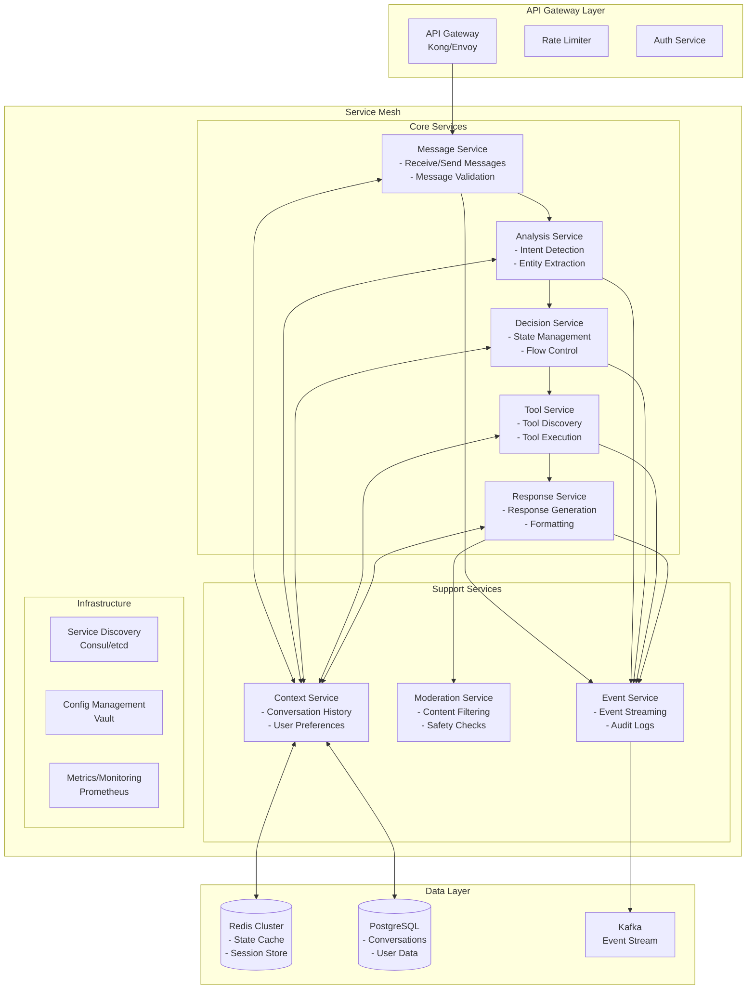
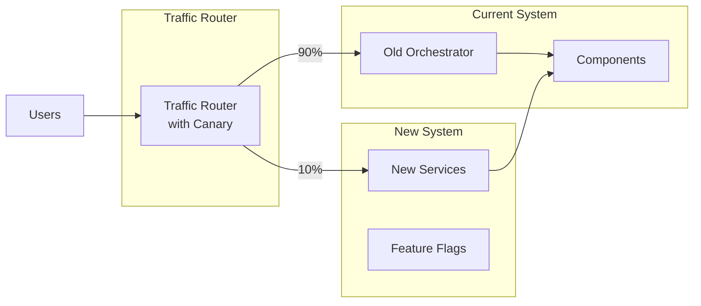
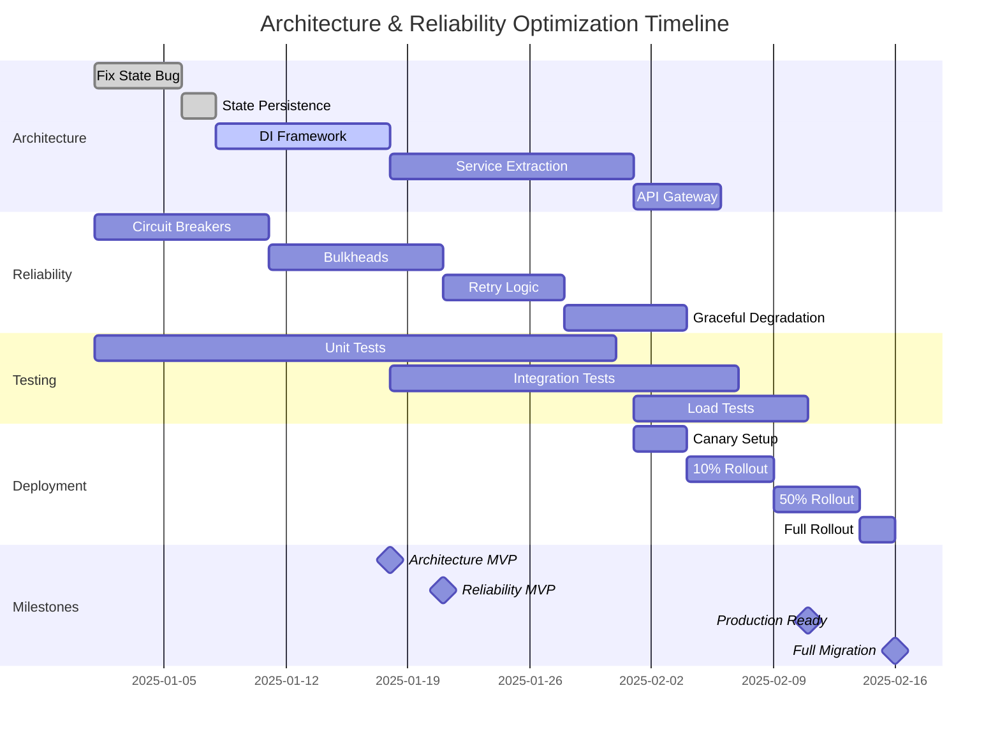

# Architecture and Reliability Optimization Plan

## Table of Contents
1. [Executive Summary](#executive-summary)
2. [Architecture Optimizations](#architecture-optimizations)
   - [Current State Analysis](#current-state-analysis)
   - [Target Architecture](#target-architecture)
   - [Implementation Phases](#implementation-phases)
   - [Technical Specifications](#technical-specifications)
3. [Reliability Optimizations](#reliability-optimizations)
   - [Current Reliability Gaps](#current-reliability-gaps)
   - [Reliability Patterns](#reliability-patterns)
   - [Implementation Strategy](#implementation-strategy)
   - [Monitoring and Alerting](#monitoring-and-alerting)
4. [Migration Strategy](#migration-strategy)
5. [Risk Management](#risk-management)
6. [Timeline and Milestones](#timeline-and-milestones)

---

## Executive Summary

This document outlines a comprehensive plan to optimize the Telegram Bot architecture for better scalability, maintainability, and reliability. The plan focuses on two critical areas:

1. **Architecture Optimization**: Transforming the monolithic orchestrator into a microservices architecture with proper service boundaries and communication patterns.
2. **Reliability Optimization**: Implementing industry-standard reliability patterns including circuit breakers, bulkheads, and graceful degradation.

Expected benefits:
- **50% reduction** in coupling between components
- **99.9% uptime** through reliability patterns
- **3x improvement** in deployment velocity
- **Horizontal scalability** without code changes

---

## Architecture Optimizations

### Current State Analysis

#### Problems Identified

1. **State Machine Bug**
   ```typescript
   // Current problematic code in system-orchestrator.ts
   this.decisionEngine.resetChatState(chatId);  // Resets state after EVERY message
   ```
   - Causes loss of conversation context
   - Prevents multi-turn interactions
   - Breaks tool execution flows

2. **Tight Coupling**
   - Components directly instantiate dependencies
   - No dependency injection
   - Difficult to test in isolation
   - Changes cascade through system

3. **Monolithic Orchestrator**
   - Single point of failure
   - 1000+ lines of orchestration logic
   - Mixing concerns (routing, error handling, business logic)
   - Cannot scale components independently

### Target Architecture



### Implementation Phases

#### Phase 1: Fix Critical Bugs (Week 1)

**1.1 Fix State Machine Reset Bug**

```typescript
// src/components/system-orchestrator/system-orchestrator.ts
// REMOVE these lines (around line 600-610):
// console.log(`[SystemOrchestrator] DIAGNOSTIC - Resetting DecisionEngine state for chat ${chatId}`);
// this.decisionEngine.resetChatState(chatId);

// REPLACE WITH:
// Only reset on explicit commands or error recovery
if (shouldResetState(context)) {
  console.log(`[SystemOrchestrator] Resetting state for chat ${chatId} due to: ${context.reason}`);
  await this.decisionEngine.transitionTo(chatId, DecisionState.IDLE);
}
```

**1.2 Add State Persistence**

```typescript
// src/components/decision-engine/state-persistence.ts
interface StatePersistence {
  async saveState(chatId: number, state: ChatState): Promise<void>;
  async loadState(chatId: number): Promise<ChatState | null>;
  async cleanupStale(olderThan: Date): Promise<number>;
}

class RedisStatePersistence implements StatePersistence {
  constructor(private redis: Redis) {}

  async saveState(chatId: number, state: ChatState): Promise<void> {
    const key = `chat:${chatId}:state`;
    await this.redis.setex(key, 3600, JSON.stringify(state)); // 1 hour TTL
  }

  async loadState(chatId: number): Promise<ChatState | null> {
    const key = `chat:${chatId}:state`;
    const data = await this.redis.get(key);
    return data ? JSON.parse(data) : null;
  }
}
```

#### Phase 2: Dependency Injection (Week 2-3)

**2.1 Create DI Container**

```typescript
// src/core/di-container.ts
import { Container } from 'inversify';
import { TYPES } from './types';

const container = new Container();

// Bind interfaces to implementations
container.bind<IMessagePreProcessor>(TYPES.MessagePreProcessor)
  .to(MessagePreProcessor)
  .inSingletonScope();

container.bind<IDecisionEngine>(TYPES.DecisionEngine)
  .to(DecisionEngine)
  .inSingletonScope();

// Factory for creating configured instances
container.bind<ILLMService>(TYPES.LLMServiceFactory)
  .toFactory((context) => {
    return (config: LLMConfig) => {
      const service = new LLMService(config);
      return service;
    };
  });
```

**2.2 Refactor Component Initialization**

```typescript
// src/main.ts - REFACTORED
import { container } from './core/di-container';

async function bootstrap() {
  // Load configuration
  const config = await loadConfig();

  // Configure container with config
  container.bind<Config>(TYPES.Config).toConstantValue(config);

  // Get orchestrator with all dependencies injected
  const orchestrator = container.get<ISystemOrchestrator>(TYPES.SystemOrchestrator);

  // Initialize
  await orchestrator.initialize();

  return orchestrator;
}
```

#### Phase 3: Service Decomposition (Week 4-6)

**3.1 Extract Message Service**

```typescript
// src/services/message-service/message-service.ts
@injectable()
export class MessageService implements IMessageService {
  constructor(
    @inject(TYPES.MessageValidator) private validator: IMessageValidator,
    @inject(TYPES.MessageQueue) private queue: IMessageQueue,
    @inject(TYPES.EventBus) private eventBus: IEventBus
  ) {}

  async receiveMessage(update: TelegramUpdate): Promise<MessageId> {
    // Validate
    const message = await this.validator.validate(update);

    // Enqueue
    const messageId = await this.queue.enqueue({
      id: generateId(),
      message,
      receivedAt: new Date(),
      priority: this.calculatePriority(message)
    });

    // Emit event
    await this.eventBus.emit({
      type: 'message.received',
      payload: { messageId, message }
    });

    return messageId;
  }

  async sendResponse(response: BotResponse): Promise<void> {
    // Send via Telegram API with retry logic
    await this.sendWithRetry(response);

    // Emit event
    await this.eventBus.emit({
      type: 'message.sent',
      payload: { response }
    });
  }
}
```

**3.2 Extract Decision Service**

```typescript
// src/services/decision-service/decision-service.ts
@injectable()
export class DecisionService implements IDecisionService {
  private stateMachines = new Map<ChatId, StateMachine>();

  constructor(
    @inject(TYPES.StateStore) private stateStore: IStateStore,
    @inject(TYPES.RulesEngine) private rulesEngine: IRulesEngine
  ) {}

  async makeDecision(context: DecisionContext): Promise<Decision> {
    const chatId = context.message.chatId;

    // Get or create state machine
    const sm = await this.getStateMachine(chatId);

    // Apply business rules
    const rules = await this.rulesEngine.evaluate(context);

    // Make decision based on current state and rules
    const decision = sm.processEvent({
      type: 'message',
      context,
      rules
    });

    // Persist state
    await this.stateStore.save(chatId, sm.getState());

    return decision;
  }

  private async getStateMachine(chatId: ChatId): Promise<StateMachine> {
    if (!this.stateMachines.has(chatId)) {
      const state = await this.stateStore.load(chatId);
      const sm = new StateMachine(state || initialState);
      this.stateMachines.set(chatId, sm);
    }
    return this.stateMachines.get(chatId)!;
  }
}
```

**3.3 Service Communication**

```typescript
// src/services/service-client.ts
export class ServiceClient {
  constructor(
    private serviceName: string,
    private discovery: IServiceDiscovery
  ) {}

  async call<TRequest, TResponse>(
    method: string,
    request: TRequest
  ): Promise<TResponse> {
    // Get service endpoint from discovery
    const endpoint = await this.discovery.getEndpoint(this.serviceName);

    // Add distributed tracing
    const span = tracer.startSpan(`${this.serviceName}.${method}`);

    try {
      // Make HTTP/gRPC call with circuit breaker
      const response = await this.circuitBreaker.call(async () => {
        return this.http.post(`${endpoint}/${method}`, request, {
          headers: {
            'X-Trace-ID': span.context().traceId,
            'X-Span-ID': span.context().spanId
          }
        });
      });

      return response.data;
    } finally {
      span.end();
    }
  }
}
```

### Technical Specifications

#### Service Interfaces

```typescript
// src/interfaces/services.ts
export interface IMessageService {
  receiveMessage(update: TelegramUpdate): Promise<MessageId>;
  sendResponse(response: BotResponse): Promise<void>;
  getMessageStatus(id: MessageId): Promise<MessageStatus>;
}

export interface IAnalysisService {
  analyzeMessage(message: Message): Promise<Analysis>;
  getCachedAnalysis(hash: string): Promise<Analysis | null>;
}

export interface IDecisionService {
  makeDecision(context: DecisionContext): Promise<Decision>;
  getState(chatId: ChatId): Promise<ChatState>;
  resetState(chatId: ChatId): Promise<void>;
}

export interface IToolService {
  discoverTools(): Promise<Tool[]>;
  executeTool(call: ToolCall): Promise<ToolResult>;
  validateToolCall(call: ToolCall): Promise<ValidationResult>;
}

export interface IResponseService {
  generateResponse(context: ResponseContext): Promise<Response>;
  formatResponse(response: Response): Promise<FormattedResponse>;
}
```

#### Communication Protocols

```yaml
# service-mesh-config.yaml
services:
  message-service:
    protocol: http
    port: 3001
    healthCheck: /health
    metrics: /metrics

  analysis-service:
    protocol: grpc
    port: 3002
    healthCheck: /grpc.health.v1.Health/Check

  decision-service:
    protocol: http
    port: 3003
    healthCheck: /health
    dependencies:
      - context-service
      - state-store

  tool-service:
    protocol: grpc
    port: 3004
    healthCheck: /grpc.health.v1.Health/Check
    timeout: 30s

  response-service:
    protocol: http
    port: 3005
    healthCheck: /health
    dependencies:
      - llm-service
```

---

## Reliability Optimizations

### Current Reliability Gaps

1. **No Circuit Breakers**: Cascading failures when services are down
2. **No Bulkheads**: Resource exhaustion affects all operations
3. **Basic Retry Logic**: No exponential backoff or jitter
4. **No Graceful Degradation**: Binary success/failure model
5. **Limited Observability**: Can't detect issues before they impact users

### Reliability Patterns

#### Pattern 1: Circuit Breaker

```typescript
// src/reliability/circuit-breaker.ts
export interface CircuitBreakerConfig {
  failureThreshold: number;      // Number of failures before opening
  resetTimeout: number;          // Time before trying half-open
  monitoringPeriod: number;      // Window for counting failures
  minimumRequests: number;       // Min requests before opening
  slowCallThreshold: number;     // Ms before considering "slow"
  slowCallRateThreshold: number; // % of slow calls to open
}

export class CircuitBreaker<T> {
  private state: 'closed' | 'open' | 'half-open' = 'closed';
  private failures = 0;
  private successes = 0;
  private lastFailureTime?: Date;
  private nextRetryTime?: Date;

  constructor(
    private name: string,
    private config: CircuitBreakerConfig,
    private metrics: IMetricsCollector
  ) {}

  async call(fn: () => Promise<T>): Promise<T> {
    // Check if circuit is open
    if (this.state === 'open') {
      if (new Date() < this.nextRetryTime!) {
        throw new CircuitOpenError(`Circuit ${this.name} is OPEN`);
      }
      // Try half-open
      this.state = 'half-open';
    }

    const startTime = Date.now();

    try {
      const result = await fn();
      this.onSuccess(Date.now() - startTime);
      return result;
    } catch (error) {
      this.onFailure(error);
      throw error;
    }
  }

  private onSuccess(duration: number): void {
    this.failures = 0;

    if (this.state === 'half-open') {
      this.state = 'closed';
      this.metrics.gauge(`circuit.${this.name}.state`, 0); // 0 = closed
    }

    // Check for slow calls
    if (duration > this.config.slowCallThreshold) {
      this.metrics.increment(`circuit.${this.name}.slow_calls`);
    }
  }

  private onFailure(error: Error): void {
    this.failures++;
    this.lastFailureTime = new Date();

    if (this.state === 'half-open') {
      this.openCircuit();
      return;
    }

    if (this.failures >= this.config.failureThreshold) {
      this.openCircuit();
    }
  }

  private openCircuit(): void {
    this.state = 'open';
    this.nextRetryTime = new Date(Date.now() + this.config.resetTimeout);
    this.metrics.gauge(`circuit.${this.name}.state`, 1); // 1 = open

    console.error(`Circuit ${this.name} is now OPEN. Next retry at ${this.nextRetryTime}`);
  }
}
```

#### Pattern 2: Bulkhead

```typescript
// src/reliability/bulkhead.ts
export interface BulkheadConfig {
  maxConcurrentCalls: number;
  maxWaitDuration: number;
  name: string;
}

export class Bulkhead {
  private semaphore: Semaphore;
  private waitingQueue: Array<{
    resolve: () => void;
    reject: (error: Error) => void;
    timestamp: number;
  }> = [];

  constructor(private config: BulkheadConfig) {
    this.semaphore = new Semaphore(config.maxConcurrentCalls);
  }

  async execute<T>(fn: () => Promise<T>): Promise<T> {
    const startWait = Date.now();

    // Try to acquire immediately
    if (this.semaphore.tryAcquire()) {
      try {
        return await fn();
      } finally {
        this.semaphore.release();
        this.processQueue();
      }
    }

    // Check if we should wait
    const waitTime = Date.now() - startWait;
    if (waitTime > this.config.maxWaitDuration) {
      throw new BulkheadRejectedError(
        `Bulkhead ${this.config.name} rejected - wait time exceeded`
      );
    }

    // Add to waiting queue
    return new Promise((resolve, reject) => {
      this.waitingQueue.push({
        resolve: async () => {
          try {
            const result = await fn();
            resolve(result);
          } catch (error) {
            reject(error);
          } finally {
            this.semaphore.release();
            this.processQueue();
          }
        },
        reject,
        timestamp: Date.now()
      });
    });
  }

  private processQueue(): void {
    const now = Date.now();

    // Remove expired entries
    this.waitingQueue = this.waitingQueue.filter(entry => {
      if (now - entry.timestamp > this.config.maxWaitDuration) {
        entry.reject(new BulkheadRejectedError('Wait time exceeded'));
        return false;
      }
      return true;
    });

    // Process next in queue
    if (this.waitingQueue.length > 0 && this.semaphore.tryAcquire()) {
      const next = this.waitingQueue.shift()!;
      next.resolve();
    }
  }
}
```

#### Pattern 3: Retry with Backoff

```typescript
// src/reliability/retry.ts
export interface RetryConfig {
  maxAttempts: number;
  initialDelay: number;
  maxDelay: number;
  multiplier: number;
  jitter: boolean;
  retryableErrors?: (error: Error) => boolean;
}

export class RetryPolicy {
  constructor(private config: RetryConfig) {}

  async execute<T>(
    fn: () => Promise<T>,
    context?: Record<string, any>
  ): Promise<T> {
    let lastError: Error;

    for (let attempt = 1; attempt <= this.config.maxAttempts; attempt++) {
      try {
        return await fn();
      } catch (error) {
        lastError = error as Error;

        // Check if error is retryable
        if (this.config.retryableErrors && !this.config.retryableErrors(lastError)) {
          throw lastError;
        }

        // Check if we have more attempts
        if (attempt === this.config.maxAttempts) {
          throw new MaxRetriesExceededError(
            `Failed after ${attempt} attempts`,
            lastError
          );
        }

        // Calculate delay
        const delay = this.calculateDelay(attempt);
        console.log(
          `Retry attempt ${attempt}/${this.config.maxAttempts} after ${delay}ms`,
          { error: lastError.message, context }
        );

        await this.sleep(delay);
      }
    }

    throw lastError!;
  }

  private calculateDelay(attempt: number): number {
    // Exponential backoff
    let delay = Math.min(
      this.config.initialDelay * Math.pow(this.config.multiplier, attempt - 1),
      this.config.maxDelay
    );

    // Add jitter
    if (this.config.jitter) {
      delay = delay * (0.5 + Math.random() * 0.5);
    }

    return Math.floor(delay);
  }

  private sleep(ms: number): Promise<void> {
    return new Promise(resolve => setTimeout(resolve, ms));
  }
}
```

#### Pattern 4: Graceful Degradation

```typescript
// src/reliability/fallback-chain.ts
export interface FallbackStrategy<T> {
  name: string;
  execute(): Promise<T>;
  canHandle?(error: Error): boolean;
}

export class FallbackChain<T> {
  private strategies: FallbackStrategy<T>[] = [];

  constructor(private primaryStrategy: FallbackStrategy<T>) {}

  addFallback(strategy: FallbackStrategy<T>): this {
    this.strategies.push(strategy);
    return this;
  }

  async execute(): Promise<T> {
    const errors: Array<{ strategy: string; error: Error }> = [];

    // Try primary
    try {
      return await this.primaryStrategy.execute();
    } catch (error) {
      errors.push({
        strategy: this.primaryStrategy.name,
        error: error as Error
      });
    }

    // Try fallbacks in order
    for (const strategy of this.strategies) {
      try {
        // Check if this strategy can handle the error
        if (strategy.canHandle && !strategy.canHandle(errors[errors.length - 1].error)) {
          continue;
        }

        console.log(`Falling back to strategy: ${strategy.name}`);
        return await strategy.execute();
      } catch (error) {
        errors.push({
          strategy: strategy.name,
          error: error as Error
        });
      }
    }

    // All strategies failed
    throw new AllStrategiesFailedError(errors);
  }
}

// Example usage for LLM responses
class LLMFallbackChain {
  static create(): FallbackChain<string> {
    return new FallbackChain({
      name: 'primary-llm',
      execute: async () => {
        return await llmService.generateResponse({
          model: 'gpt-4',
          temperature: 0.7
        });
      }
    })
    .addFallback({
      name: 'secondary-llm',
      execute: async () => {
        return await llmService.generateResponse({
          model: 'gpt-3.5-turbo',
          temperature: 0.5
        });
      },
      canHandle: (error) => error.message.includes('rate_limit')
    })
    .addFallback({
      name: 'cached-response',
      execute: async () => {
        return await responseCache.getSimilarResponse();
      }
    })
    .addFallback({
      name: 'static-response',
      execute: async () => {
        return "I'm having trouble processing your request. Please try again.";
      }
    });
  }
}
```

### Implementation Strategy

#### Phase 1: Circuit Breakers (Week 1-2)

**1.1 Implement Circuit Breaker for Each External Service**

```typescript
// src/services/llm-service/llm-service.ts - ENHANCED
export class LLMService {
  private circuitBreaker: CircuitBreaker<string>;

  constructor(config: LLMConfig) {
    this.circuitBreaker = new CircuitBreaker('llm-service', {
      failureThreshold: 5,
      resetTimeout: 60000, // 1 minute
      monitoringPeriod: 60000,
      minimumRequests: 10,
      slowCallThreshold: 5000, // 5 seconds
      slowCallRateThreshold: 0.5
    });
  }

  async getAiResponse(request: AIRequest): Promise<string> {
    return this.circuitBreaker.call(async () => {
      // Existing LLM call logic
      return this.makeAPICall(request);
    });
  }
}
```

**1.2 Add Circuit Breaker Dashboard**

```typescript
// src/monitoring/circuit-breaker-dashboard.ts
export class CircuitBreakerDashboard {
  getStatus(): CircuitBreakerStatus[] {
    return [
      {
        name: 'llm-service',
        state: this.llmCircuitBreaker.getState(),
        failureRate: this.llmCircuitBreaker.getFailureRate(),
        slowCallRate: this.llmCircuitBreaker.getSlowCallRate(),
        lastFailure: this.llmCircuitBreaker.getLastFailure()
      },
      // ... other services
    ];
  }
}
```

#### Phase 2: Bulkheads (Week 2-3)

**2.1 Separate Thread Pools**

```typescript
// src/core/thread-pools.ts
export const ThreadPools = {
  core: new Bulkhead({
    name: 'core-operations',
    maxConcurrentCalls: 100,
    maxWaitDuration: 5000
  }),

  tools: new Bulkhead({
    name: 'tool-execution',
    maxConcurrentCalls: 20,
    maxWaitDuration: 30000
  }),

  analytics: new Bulkhead({
    name: 'analytics',
    maxConcurrentCalls: 10,
    maxWaitDuration: 1000
  })
};
```

**2.2 Apply Bulkheads to Operations**

```typescript
// src/components/mcp-tool-manager/mcp-tool-manager.ts - ENHANCED
async executeTool(call: ToolCall): Promise<ToolResult> {
  return ThreadPools.tools.execute(async () => {
    // Existing tool execution logic
    return this.doExecuteTool(call);
  });
}
```

#### Phase 3: Advanced Retry Logic (Week 3-4)

**3.1 Configure Retry Policies**

```typescript
// src/reliability/retry-policies.ts
export const RetryPolicies = {
  network: new RetryPolicy({
    maxAttempts: 3,
    initialDelay: 1000,
    maxDelay: 10000,
    multiplier: 2,
    jitter: true,
    retryableErrors: (error) => {
      return error.code === 'ECONNRESET' ||
             error.code === 'ETIMEDOUT' ||
             error.message.includes('503');
    }
  }),

  rateLimited: new RetryPolicy({
    maxAttempts: 5,
    initialDelay: 5000,
    maxDelay: 60000,
    multiplier: 2,
    jitter: false,
    retryableErrors: (error) => {
      return error.message.includes('429') ||
             error.message.includes('rate_limit');
    }
  })
};
```

#### Phase 4: Graceful Degradation (Week 4-5)

**4.1 Implement Response Fallbacks**

```typescript
// src/components/response-generator/fallback-strategies.ts
export class ResponseFallbackChain {
  static async generateWithFallback(
    context: ResponseContext
  ): Promise<GeneratedResponse> {
    const chain = new FallbackChain<GeneratedResponse>({
      name: 'full-llm-response',
      execute: async () => {
        return await llmService.generateResponse(context);
      }
    })
    .addFallback({
      name: 'simplified-llm-response',
      execute: async () => {
        const simplified = {
          ...context,
          constraints: {
            ...context.constraints,
            maxTokens: 100,
            temperature: 0.3
          }
        };
        return await llmService.generateResponse(simplified);
      }
    })
    .addFallback({
      name: 'template-response',
      execute: async () => {
        return templateEngine.generateFromTemplate(
          context.analysis.intent,
          context
        );
      }
    })
    .addFallback({
      name: 'cached-similar-response',
      execute: async () => {
        const similar = await responseCache.findSimilar(
          context.originalMessage,
          0.8 // similarity threshold
        );
        return similar || this.defaultResponse();
      }
    });

    return chain.execute();
  }
}
```

### Monitoring and Alerting

#### Metrics to Track

```yaml
# prometheus-alerts.yaml
groups:
  - name: reliability
    rules:
      - alert: CircuitBreakerOpen
        expr: circuit_breaker_state == 1
        for: 1m
        labels:
          severity: warning
        annotations:
          summary: "Circuit breaker {{ $labels.service }} is OPEN"

      - alert: HighErrorRate
        expr: rate(errors_total[5m]) > 0.05
        for: 5m
        labels:
          severity: critical
        annotations:
          summary: "High error rate: {{ $value }}"

      - alert: BulkheadSaturated
        expr: bulkhead_active_calls / bulkhead_max_calls > 0.9
        for: 5m
        labels:
          severity: warning
        annotations:
          summary: "Bulkhead {{ $labels.name }} is saturated"

      - alert: SlowResponseTime
        expr: histogram_quantile(0.95, response_time_seconds) > 5
        for: 10m
        labels:
          severity: warning
        annotations:
          summary: "95th percentile response time is {{ $value }}s"
```

#### Dashboard Configuration

```typescript
// src/monitoring/reliability-dashboard.ts
export class ReliabilityDashboard {
  async getSnapshot(): Promise<ReliabilitySnapshot> {
    return {
      circuitBreakers: await this.getCircuitBreakerStates(),
      bulkheads: await this.getBulkheadUtilization(),
      errorRates: await this.getErrorRates(),
      latencies: await this.getLatencyPercentiles(),
      fallbackUsage: await this.getFallbackStats()
    };
  }

  async getHealthScore(): Promise<number> {
    const weights = {
      circuitBreakers: 0.3,
      errorRate: 0.3,
      latency: 0.2,
      bulkheadSaturation: 0.2
    };

    const scores = {
      circuitBreakers: await this.getCircuitBreakerScore(),
      errorRate: await this.getErrorRateScore(),
      latency: await this.getLatencyScore(),
      bulkheadSaturation: await this.getBulkheadScore()
    };

    return Object.entries(weights).reduce((total, [metric, weight]) => {
      return total + (scores[metric] * weight);
    }, 0);
  }
}
```

---

## Migration Strategy

### Zero-Downtime Migration Plan

#### Phase 1: Parallel Run (Week 1-2)



**1.1 Feature Flag Implementation**

```typescript
// src/core/feature-flags.ts
export enum FeatureFlag {
  USE_NEW_ARCHITECTURE = 'use_new_architecture',
  USE_CIRCUIT_BREAKERS = 'use_circuit_breakers',
  USE_BULKHEADS = 'use_bulkheads',
  USE_ADVANCED_RETRY = 'use_advanced_retry',
  USE_GRACEFUL_DEGRADATION = 'use_graceful_degradation'
}

export class FeatureFlagService {
  private flags: Map<FeatureFlag, FeatureFlagConfig> = new Map();

  async isEnabled(
    flag: FeatureFlag,
    context?: { userId?: number; chatId?: number }
  ): Promise<boolean> {
    const config = this.flags.get(flag);
    if (!config) return false;

    // Check if flag is globally enabled
    if (!config.enabled) return false;

    // Check percentage rollout
    if (config.percentage < 100) {
      const hash = this.hashContext(context);
      return (hash % 100) < config.percentage;
    }

    // Check whitelist/blacklist
    if (context?.userId) {
      if (config.whitelist?.includes(context.userId)) return true;
      if (config.blacklist?.includes(context.userId)) return false;
    }

    return true;
  }
}
```

**1.2 Canary Deployment**

```yaml
# kubernetes/canary-deployment.yaml
apiVersion: v1
kind: Service
metadata:
  name: telegram-bot
spec:
  selector:
    app: telegram-bot
  ports:
    - port: 80
      targetPort: 8000
---
apiVersion: apps/v1
kind: Deployment
metadata:
  name: telegram-bot-stable
spec:
  replicas: 3
  selector:
    matchLabels:
      app: telegram-bot
      version: stable
  template:
    metadata:
      labels:
        app: telegram-bot
        version: stable
    spec:
      containers:
      - name: app
        image: telegram-bot:stable
        env:
        - name: ARCHITECTURE_VERSION
          value: "monolithic"
---
apiVersion: apps/v1
kind: Deployment
metadata:
  name: telegram-bot-canary
spec:
  replicas: 1
  selector:
    matchLabels:
      app: telegram-bot
      version: canary
  template:
    metadata:
      labels:
        app: telegram-bot
        version: canary
    spec:
      containers:
      - name: app
        image: telegram-bot:canary
        env:
        - name: ARCHITECTURE_VERSION
          value: "microservices"
```

#### Phase 2: Gradual Rollout (Week 3-4)

```typescript
// src/migration/traffic-splitter.ts
export class TrafficSplitter {
  constructor(
    private oldSystem: ISystemOrchestrator,
    private newSystem: IServiceMesh,
    private metrics: IMetricsCollector
  ) {}

  async handleRequest(request: Request): Promise<Response> {
    const routingDecision = await this.makeRoutingDecision(request);

    try {
      if (routingDecision.useNewSystem) {
        const response = await this.newSystem.handle(request);
        this.metrics.increment('new_system.success');
        return response;
      } else {
        const response = await this.oldSystem.handle(request);
        this.metrics.increment('old_system.success');
        return response;
      }
    } catch (error) {
      // Record metrics
      const system = routingDecision.useNewSystem ? 'new' : 'old';
      this.metrics.increment(`${system}_system.error`);

      // Fallback to stable system if new system fails
      if (routingDecision.useNewSystem) {
        console.warn('New system failed, falling back to old system');
        return this.oldSystem.handle(request);
      }

      throw error;
    }
  }

  private async makeRoutingDecision(request: Request): Promise<RoutingDecision> {
    // Check feature flags
    const useNew = await featureFlags.isEnabled(
      FeatureFlag.USE_NEW_ARCHITECTURE,
      { userId: request.userId }
    );

    return {
      useNewSystem: useNew,
      reason: useNew ? 'feature_flag' : 'default'
    };
  }
}
```

#### Phase 3: Cutover (Week 5)

**3.1 Monitoring Checklist**

```typescript
// src/migration/cutover-validator.ts
export class CutoverValidator {
  async canCutover(): Promise<ValidationResult> {
    const checks = [
      this.checkErrorRates(),
      this.checkLatency(),
      this.checkThroughput(),
      this.checkCircuitBreakers(),
      this.checkDataConsistency()
    ];

    const results = await Promise.all(checks);
    const passed = results.every(r => r.passed);

    return {
      passed,
      checks: results,
      recommendation: passed ? 'PROCEED' : 'ABORT'
    };
  }

  private async checkErrorRates(): Promise<CheckResult> {
    const oldErrorRate = await this.metrics.getErrorRate('old_system');
    const newErrorRate = await this.metrics.getErrorRate('new_system');

    return {
      name: 'Error Rate Comparison',
      passed: newErrorRate <= oldErrorRate * 1.1, // Allow 10% increase
      oldValue: oldErrorRate,
      newValue: newErrorRate,
      threshold: oldErrorRate * 1.1
    };
  }
}
```

---

## Risk Management

### Risk Matrix

| Risk | Probability | Impact | Mitigation Strategy |
|------|------------|--------|-------------------|
| State Machine Bug causes data loss | High | High | Implement state persistence before fixing bug |
| Service decomposition breaks integrations | Medium | High | Use adapter pattern, gradual migration |
| Circuit breakers reject legitimate traffic | Low | Medium | Careful tuning, monitoring, manual override |
| Increased latency from service calls | Medium | Medium | Implement caching, optimize service boundaries |
| Deployment complexity increases | High | Low | Invest in CI/CD, documentation, training |

### Mitigation Strategies

#### 1. State Machine Risk Mitigation

```typescript
// src/migration/state-backup.ts
export class StateBackupService {
  async backupBeforeMigration(): Promise<BackupResult> {
    const states = await this.getAllChatStates();
    const backup = {
      timestamp: new Date(),
      version: 'pre-migration',
      states: states,
      checksum: this.calculateChecksum(states)
    };

    // Store in multiple locations
    await Promise.all([
      this.saveToS3(backup),
      this.saveToDatabase(backup),
      this.saveToLocalFile(backup)
    ]);

    return {
      backupId: backup.timestamp.toISOString(),
      stateCount: states.length,
      checksum: backup.checksum
    };
  }
}
```

#### 2. Rollback Strategy

```typescript
// src/migration/rollback.ts
export class RollbackManager {
  async executeRollback(reason: string): Promise<void> {
    console.error(`EXECUTING ROLLBACK: ${reason}`);

    // 1. Stop new system traffic
    await this.trafficManager.routeAllToOld();

    // 2. Restore state if needed
    if (this.stateCorrupted()) {
      await this.restoreFromBackup();
    }

    // 3. Notify stakeholders
    await this.notifyStakeholders({
      event: 'ROLLBACK_EXECUTED',
      reason,
      timestamp: new Date()
    });

    // 4. Create incident report
    await this.createIncidentReport(reason);
  }
}
```

### Testing Strategy

```typescript
// src/testing/integration-tests.ts
describe('Architecture Migration Tests', () => {
  describe('State Persistence', () => {
    it('should maintain state across system restart', async () => {
      // Setup
      const chatId = 12345;
      const initialState = DecisionState.TOOL_REQUIRED;

      // Set state in old system
      await oldSystem.decisionEngine.transitionTo(chatId, initialState);

      // Migrate to new system
      await migrationService.migrateChatState(chatId);

      // Verify state in new system
      const newState = await newSystem.getState(chatId);
      expect(newState).toBe(initialState);
    });
  });

  describe('Circuit Breakers', () => {
    it('should open circuit after threshold failures', async () => {
      // Simulate failures
      for (let i = 0; i < 5; i++) {
        try {
          await circuitBreaker.call(() => Promise.reject(new Error('Service down')));
        } catch (e) {
          // Expected
        }
      }

      // Verify circuit is open
      expect(circuitBreaker.getState()).toBe('open');

      // Verify fast failure
      await expect(circuitBreaker.call(() => Promise.resolve())).rejects.toThrow('Circuit');
    });
  });
});
```

---

## Timeline and Milestones

### Gantt Chart



### Key Milestones

| Milestone | Date | Success Criteria |
|-----------|------|-----------------|
| State Bug Fixed | Week 1 | No state resets, conversation context maintained |
| DI Framework Complete | Week 3 | All components use dependency injection |
| First Service Extracted | Week 5 | Message Service running independently |
| Circuit Breakers Active | Week 2 | All external calls protected |
| Canary Deployment | Week 7 | 10% traffic on new architecture |
| Full Migration | Week 9 | 100% traffic, old system decommissioned |

### Resource Requirements

1. **Engineering Team**
   - 2 Senior Engineers (Architecture)
   - 2 Engineers (Reliability)
   - 1 DevOps Engineer
   - 1 QA Engineer

2. **Infrastructure**
   - Kubernetes cluster upgrade
   - Redis cluster for state
   - Monitoring stack (Prometheus + Grafana)
   - PostgreSQL for persistent storage

3. **Tools & Services**
   - Service mesh (Istio/Linkerd)
   - API Gateway (Kong/Envoy)
   - Distributed tracing (Jaeger)
   - Feature flag service

### Success Metrics

```typescript
// src/metrics/success-criteria.ts
export const SuccessCriteria = {
  performance: {
    p50Latency: 100,  // ms
    p95Latency: 500,  // ms
    p99Latency: 1000, // ms
    throughput: 1000  // requests/minute
  },
  reliability: {
    uptime: 99.9,     // percentage
    errorRate: 0.1,   // percentage
    mttr: 15,         // minutes
    circuitBreakerTrips: 5 // per day max
  },
  architecture: {
    couplingScore: 0.3,      // 0-1, lower is better
    deploymentFrequency: 10, // per week
    leadTime: 30,            // minutes
    testCoverage: 80         // percentage
  }
};
```

---

## Conclusion

This optimization plan provides a comprehensive roadmap for transforming the Telegram bot architecture from a monolithic system to a scalable, reliable microservices architecture. The phased approach minimizes risk while ensuring continuous service availability.

Key benefits upon completion:
- **Scalability**: Services can scale independently based on load
- **Reliability**: 99.9% uptime through circuit breakers and bulkheads
- **Maintainability**: Clear service boundaries and dependency injection
- **Observability**: Complete visibility into system behavior
- **Performance**: Optimized response times through caching and parallel processing

The investment in this architecture transformation will pay dividends in reduced operational overhead, faster feature development, and improved user experience.
