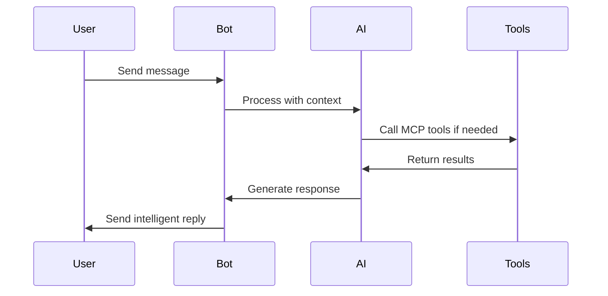

# Product Context: Telegram Interface Bot

## Why This Project Exists

### Problem Statement
Modern users need intelligent, conversational interfaces that can help them accomplish tasks, get information, and interact with various services seamlessly. Traditional chatbots are limited by their rigid, pre-programmed responses and inability to integrate with external tools and services.

### Market Need
- **Information Access**: Users need quick access to diverse information sources (weather, search, files, etc.)
- **Tool Integration**: Desire for a single interface that can interact with multiple services
- **Conversational AI**: Natural language interaction with intelligent response generation
- **Scalable Deployment**: Edge computing for global accessibility and low latency

## Problems This Project Solves

### 1. Fragmented Tool Access
**Problem**: Users must switch between multiple apps/services to accomplish tasks.
**Solution**: Single Telegram interface that connects to multiple MCP servers for diverse functionality.

### 2. Static Bot Responses
**Problem**: Traditional bots provide rigid, predetermined responses.
**Solution**: AI-powered conversation with context awareness and dynamic response generation.

### 3. Poor Performance at Scale
**Problem**: Simple bots struggle with high message volumes and concurrent users.
**Solution**: Message queue system, connection pooling, and caching for optimal performance.

### 4. Limited Context Retention
**Problem**: Bots lose conversation context between interactions.
**Solution**: Persistent conversation history with intelligent context management.

### 5. Complex Deployment and Scaling
**Problem**: Traditional bot hosting requires server management and scaling concerns.
**Solution**: Serverless deployment on Deno Deploy with automatic scaling.

## How It Should Work

### User Experience Flow

### Key User Interactions

1. **Natural Conversations**
   - Users chat in natural language
   - Bot understands context and intent
   - Responses feel conversational, not robotic

2. **Tool Usage**
   - Users request information (weather, search, etc.)
   - Bot automatically determines appropriate tools
   - Results integrated into conversational response

3. **Context Continuity**
   - Bot remembers conversation history
   - References to previous topics work naturally
   - Long-term conversation relationships

4. **Performance Expectations**
   - Fast response times (<2 seconds)
   - Handles multiple concurrent conversations
   - Reliable availability (>99.9% uptime)

## User Experience Goals

### Primary Objectives

1. **Intuitive Interaction**
   - Natural language understanding
   - No command syntax to learn
   - Context-aware responses

2. **Reliable Performance**
   - Fast response times
   - Consistent availability
   - Graceful error handling

3. **Rich Functionality**
   - Access to multiple tool ecosystems
   - Intelligent tool selection
   - Comprehensive capability discovery

4. **Conversational Continuity**
   - Persistent conversation memory
   - Cross-session context retention
   - Relationship building over time

### User Personas

#### Primary: Information Seekers
- **Need**: Quick access to various information sources
- **Behavior**: Ask questions, request data, seek explanations
- **Value**: Speed, accuracy, comprehensive responses

#### Secondary: Task Automators
- **Need**: Execute actions through conversational interface
- **Behavior**: Request services, automate workflows, integrate tools
- **Value**: Efficiency, integration, single interface

#### Tertiary: Casual Conversationalists
- **Need**: Engaging conversation partner
- **Behavior**: Chat for entertainment, exploration, learning
- **Value**: Intelligence, personality, context retention

## Success Metrics

### User Satisfaction
- Response relevance and accuracy
- Conversation flow quality
- Task completion rates
- User retention and engagement

### Performance Metrics
- Response time (target: <2 seconds)
- System availability (target: >99.9%)
- Concurrent user capacity
- Error rates (target: <1%)

### Feature Adoption
- Tool usage frequency
- Conversation length and depth
- Return user percentage
- Feature discovery rates

## Competitive Advantages

### Technical Differentiators
1. **MCP Protocol Integration**: Standards-based tool connectivity
2. **Edge Computing**: Global deployment with low latency
3. **Advanced Caching**: Multi-layer performance optimization
4. **Serverless Architecture**: Automatic scaling and cost efficiency

### User Experience Differentiators
1. **True Conversational AI**: Context-aware, intelligent responses
2. **Seamless Tool Integration**: Transparent access to multiple services
3. **Persistent Context**: Long-term conversation memory
4. **High Performance**: Fast, reliable responses at scale

## Future Vision

### Short-term (Phase 4)
- Comprehensive testing and monitoring
- Production deployment optimization
- User feedback integration
- Performance fine-tuning

### Medium-term
- Multi-language support
- Advanced conversation features
- Extended MCP server ecosystem
- Voice interaction capabilities

### Long-term
- AI personality customization
- Advanced workflow automation
- Enterprise integration features
- Multi-platform deployment