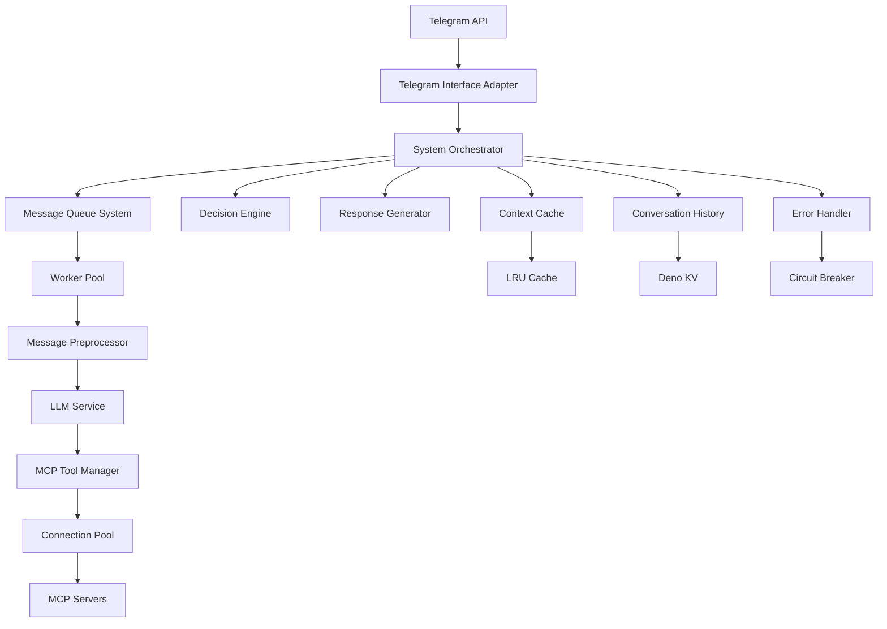
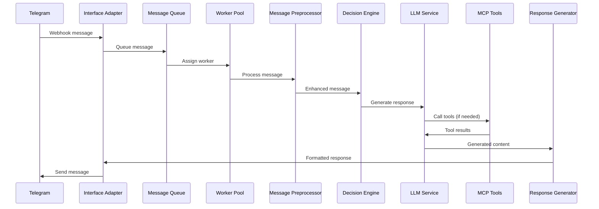
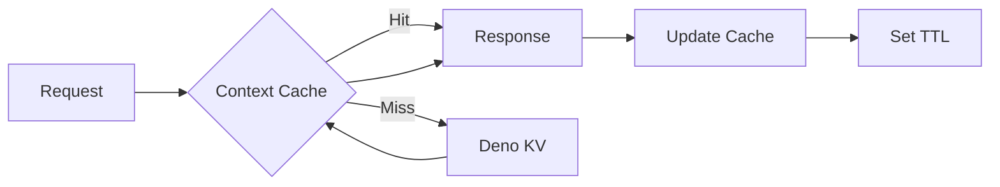
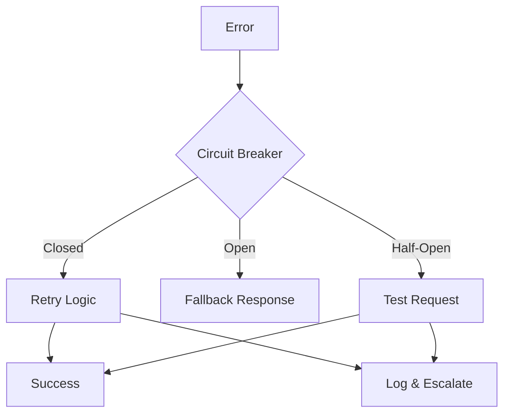

# System Patterns: Telegram Interface Bot

## Architecture Overview

The Telegram Interface Bot follows a modular, event-driven architecture optimized for serverless deployment with sophisticated performance and scaling capabilities.



## Core Design Patterns

### 1. Event-Driven Architecture

**Pattern**: Central event bus with publish-subscribe model
**Implementation**: `src/services/event-bus/`
**Benefits**: Loose coupling, extensibility, testability

```typescript
// Event flow example
EventBus.publish('message:received', { chatId, message });
EventBus.subscribe('message:processed', handleProcessedMessage);
```

### 2. Message Queue with Priority Processing

**Pattern**: Priority queue with worker pool
**Implementation**: `src/services/message-queue/`
**Components**:
- `PriorityQueue`: Heap-based priority ordering
- `WorkerPool`: Configurable worker count and load balancing
- `MessageQueue`: Main coordinator with backpressure handling

**Benefits**:
- Handles message bursts effectively
- Prioritizes user interactions
- Prevents system overload

### 3. Connection Pool Pattern

**Pattern**: Object pool with health monitoring
**Implementation**: `src/services/mcp-connection-pool/`
**Features**:
- Connection lifecycle management
- Health checks with circuit breaker
- Automatic connection recovery
- Resource limits and timeouts

**Benefits**:
- Efficient resource utilization
- Improved reliability
- Better performance under load

### 4. Multi-Layer Caching Strategy

**Pattern**: LRU cache with TTL
**Implementation**: `src/services/context-cache/`
**Layers**:
- **L1**: In-memory LRU cache for frequently accessed data
- **L2**: Deno KV for persistent conversation context
- **TTL**: Time-based expiration for cache invalidation

**Benefits**:
- Reduced API calls
- Faster response times
- Memory-efficient storage

### 5. Circuit Breaker Pattern

**Pattern**: Fail-fast with automatic recovery
**Implementation**: Integrated into error handling services
**States**: Closed → Open → Half-Open → Closed
**Benefits**:
- Prevents cascade failures
- Improves system resilience
- Automatic error recovery

## Component Architecture

### Core Components

#### 1. System Orchestrator
**Location**: `src/components/system-orchestrator/`
**Responsibility**: Central coordination and workflow management
**Patterns**: Mediator, Command
**Key Features**:
- Component lifecycle management
- Inter-component communication
- Error propagation and handling

#### 2. Message Pre-Processor
**Location**: `src/components/message-pre-processor/`
**Responsibility**: Input validation, context building, prompt preparation
**Patterns**: Chain of Responsibility, Strategy
**Key Features**:
- Message sanitization and validation
- Context retrieval and assembly
- LLM prompt construction

#### 3. Decision Engine
**Location**: `src/components/decision-engine/`
**Responsibility**: Conversation flow control and response strategy
**Patterns**: State Machine, Strategy
**Key Features**:
- Conversation state management
- Response type determination
- Tool calling decisions

#### 4. MCP Tool Manager
**Location**: `src/components/mcp-tool-manager/`
**Responsibility**: External tool integration and management
**Patterns**: Adapter, Factory, Proxy
**Key Features**:
- Dynamic tool discovery
- Protocol abstraction
- Request/response marshaling

#### 5. Response Generator
**Location**: `src/components/response-generator/`
**Responsibility**: Response formatting and delivery preparation
**Patterns**: Template Method, Builder
**Key Features**:
- Multi-format response generation
- Keyboard/UI element creation
- Content moderation integration

### Service Layer

#### 1. LLM Service
**Location**: `src/services/llm-service/`
**Integration**: OpenRouter API with DeepSeek models
**Features**:
- Multiple model support
- Streaming responses
- Token management
- Error handling with retries

#### 2. Conversation History Service
**Location**: `src/services/conversation-history.ts`
**Storage**: Deno KV
**Features**:
- Persistent conversation context
- Automatic cleanup (24-hour TTL)
- Token-aware context building
- Cross-session continuity

#### 3. Error Handler Service
**Location**: `src/services/error-handler.ts`
**Patterns**: Circuit Breaker, Retry
**Features**:
- Graduated error responses
- Automatic retry with backoff
- Circuit breaker integration
- Comprehensive error logging

## Data Flow Patterns

### 1. Message Processing Pipeline



### 2. Context Management Flow



### 3. Error Handling Flow



## Performance Optimization Patterns

### 1. Lazy Loading
- MCP connections established on-demand
- Tools loaded when first accessed
- Conversation context loaded incrementally

### 2. Connection Reuse
- MCP connection pooling
- HTTP client connection persistence
- Resource sharing across requests

### 3. Caching Strategy
- Multi-level caching (memory + persistent)
- Smart cache invalidation
- Predictive cache warming

### 4. Backpressure Handling
- Queue size limits
- Worker pool saturation detection
- Graceful degradation under load

## Security Patterns

### 1. Input Validation
- Message sanitization
- Command injection prevention
- Rate limiting per user

### 2. Secrets Management
- Environment variable storage
- No secrets in code/logs
- Secure credential rotation

### 3. Error Information Disclosure
- Generic error messages to users
- Detailed logging for developers
- No sensitive data in responses

## Scalability Patterns

### 1. Horizontal Scaling
- Stateless service design
- Shared state in Deno KV
- Edge deployment capability

### 2. Resource Management
- Connection pool limits
- Memory usage monitoring
- CPU-bound task distribution

### 3. Graceful Degradation
- Reduced functionality under load
- Timeout-based failovers
- Priority-based resource allocation

## Testing Patterns

### 1. Component Testing
- Individual component isolation
- Mock external dependencies
- Contract testing for interfaces

### 2. Integration Testing
- End-to-end message flows
- MCP server integration tests
- Error scenario validation

### 3. Performance Testing
- Load testing with concurrent users
- Memory leak detection
- Response time validation

## Deployment Patterns

### 1. Blue-Green Deployment
- Production and preview environments
- Separate webhook configurations
- Zero-downtime updates

### 2. Feature Flags
- Environment-based configuration
- Gradual feature rollout
- A/B testing capability

### 3. Monitoring Integration
- Health check endpoints
- Performance metrics collection
- Error rate monitoring