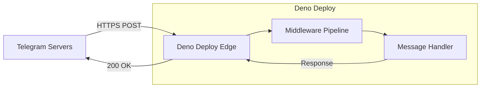
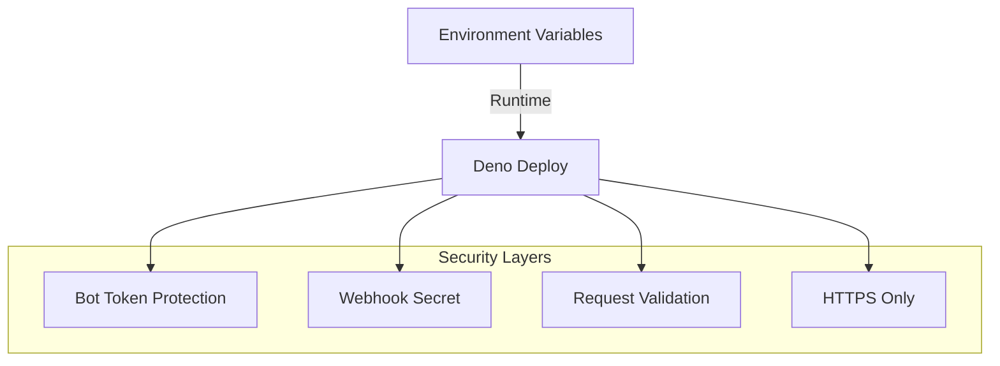
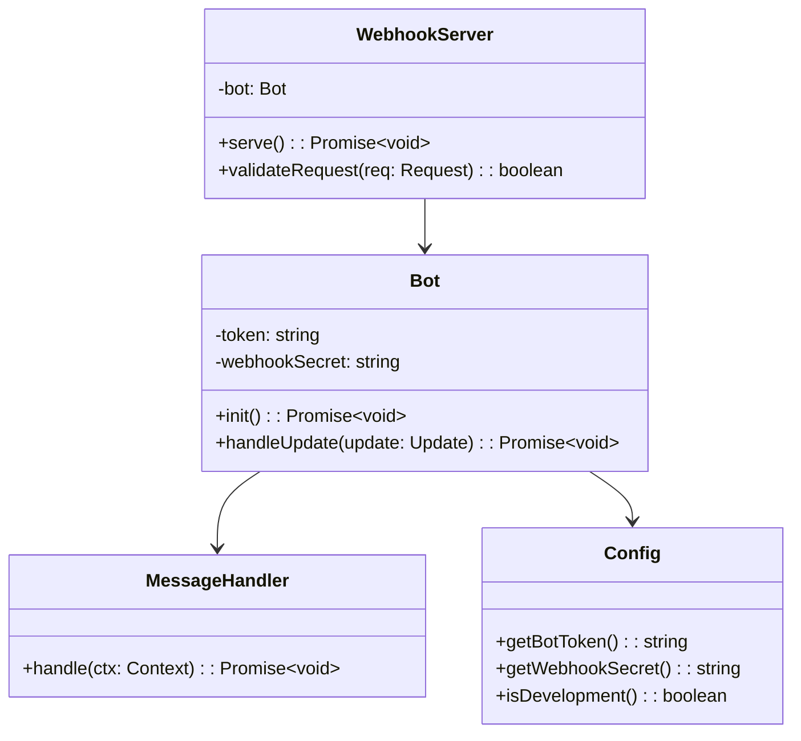
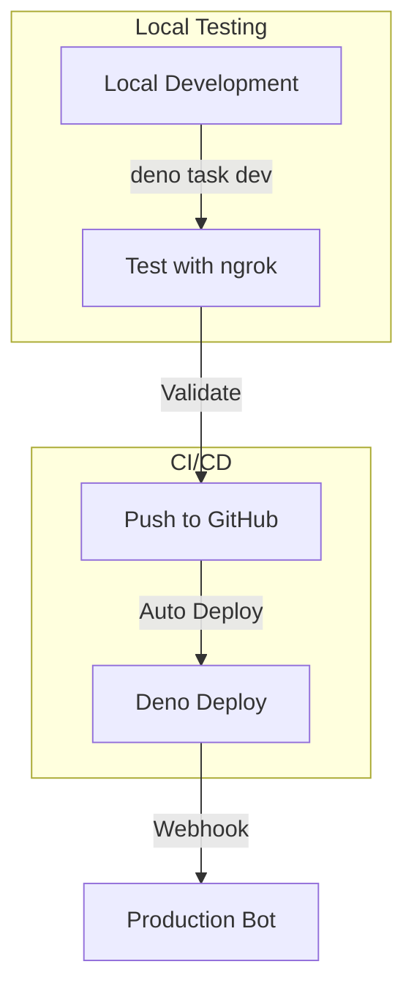

# Telegram Bot Architecture for Deno Deploy

## Overview

This document outlines the architecture for a minimal Telegram chatbot designed to run on Deno Deploy, a serverless edge runtime. The bot will respond "ok" to all messages while maintaining security best practices and serverless compatibility.

## Key Architectural Decisions

### 1. Runtime Environment: Deno Deploy

**Why Deno Deploy?**
- Edge-first serverless platform with global distribution
- Native TypeScript support without compilation
- Built-in security model (permissions-based)
- Automatic HTTPS endpoints
- Zero-config deployments
- Free tier suitable for bot development

**Constraints:**
- No persistent file system
- No long-running processes
- Request timeout limits (varies by plan)
- Limited to Web APIs (no Node.js APIs)

### 2. Telegram Bot Library: grammy

**Selected Library:** [grammy](https://grammy.dev/)

**Why grammy?**
- First-class Deno support
- Lightweight and modular
- Built for serverless environments
- Type-safe with excellent TypeScript support
- Webhook-friendly design
- Active maintenance and community

**Alternative Considered:**
- `telegram-bot-api`: Lower-level, more control but requires more boilerplate
- Direct Telegram API calls: Maximum flexibility but significant implementation overhead

### 3. Project Structure

```
telegram-bot/
├── deno.json              # Deno configuration
├── .env.example           # Example environment variables
├── .gitignore             # Git ignore file
├── README.md              # Project documentation
├── deploy.yml             # GitHub Actions deployment
│
├── src/
│   ├── main.ts           # Entry point for Deno Deploy
│   ├── bot.ts            # Bot initialization and configuration
│   ├── handlers/         # Message and command handlers
│   │   └── message.ts    # Basic message handler
│   ├── middleware/       # Bot middleware
│   │   └── logger.ts     # Request logging
│   └── utils/            # Utility functions
│       └── config.ts     # Configuration management
│
└── tests/
    └── bot.test.ts       # Basic test suite
```

### 4. Webhook Architecture



**Webhook Strategy:**
- Use Telegram's `setWebhook` API to register Deno Deploy URL
- Each incoming update triggers a new serverless function execution
- Stateless processing - no session persistence between requests
- Immediate response pattern (no long polling)

**Webhook URL Pattern:**
```
https://{project-name}.deno.dev/webhook/{webhook-secret}
```

### 5. Security Architecture



**Security Measures:**

1. **Bot Token Protection:**
   - Store in Deno Deploy environment variables
   - Never commit to repository
   - Access via `Deno.env.get("BOT_TOKEN")`

2. **Webhook Security:**
   - Generate random webhook secret path
   - Validate all incoming requests
   - Only accept HTTPS connections

3. **Request Validation:**
   - Verify requests come from Telegram
   - Check update_id to prevent replay attacks
   - Implement rate limiting if needed

### 6. Configuration Management

**Environment Variables:**
```typescript
interface Config {
  BOT_TOKEN: string;        // Telegram bot token
  WEBHOOK_SECRET: string;   // Random string for webhook path
  LOG_LEVEL: string;        // "debug" | "info" | "error"
  ENVIRONMENT: string;      // "development" | "production"
}
```

**Local Development:**
- Use `.env` file with `--allow-env` permission
- Deno automatically loads `.env` files

**Production (Deno Deploy):**
- Set via Deno Deploy dashboard
- Accessed through `Deno.env.get()`

### 7. MVP Implementation Approach

#### Phase 1: Basic Setup (Day 1)
1. Initialize project structure
2. Set up Deno configuration
3. Install grammy dependencies
4. Create basic bot instance

#### Phase 2: Core Functionality (Day 1)
1. Implement webhook handler
2. Create message handler ("ok" response)
3. Add basic error handling
4. Set up logging middleware

#### Phase 3: Deployment (Day 1)
1. Configure Deno Deploy project
2. Set environment variables
3. Deploy and register webhook
4. Test end-to-end flow

#### Phase 4: Production Readiness (Day 2)
1. Add comprehensive error handling
2. Implement health check endpoint
3. Set up monitoring/logging
4. Document deployment process

### 8. Code Architecture



### 9. Error Handling Strategy

1. **Graceful Degradation:**
   - Catch all errors to prevent function crashes
   - Log errors for debugging
   - Return appropriate HTTP status codes

2. **Error Types:**
   - Network errors (Telegram API)
   - Validation errors (malformed updates)
   - Application errors (handler failures)

3. **Recovery:**
   - Automatic retry by Telegram for failed webhooks
   - Exponential backoff for API calls
   - Circuit breaker for persistent failures

### 10. Development Workflow



**Local Development:**
1. Use `deno task dev` with file watching
2. Test with ngrok for webhook testing
3. Use Telegram test environment if needed

**Deployment:**
1. Push to GitHub main branch
2. Automatic deployment via Deno Deploy GitHub integration
3. Zero-downtime deployments

### 11. Monitoring and Observability

**Logging:**
- Structured JSON logs
- Include request IDs for tracing
- Log levels: DEBUG, INFO, WARN, ERROR

**Metrics to Track:**
- Request count
- Response times
- Error rates
- Webhook validation failures

**Health Checks:**
- `/health` endpoint for uptime monitoring
- `/metrics` endpoint for basic statistics

### 12. Scalability Considerations

**Current Design:**
- Stateless architecture scales horizontally
- Each request handled independently
- No shared state between executions

**Future Enhancements:**
- Add Deno KV for state persistence
- Implement command system
- Add user session management
- Integrate with external APIs

## Technical Specifications

### Dependencies

```json
{
  "imports": {
    "grammy": "https://deno.land/x/grammy@v1.21.1/mod.ts",
    "grammy/types": "https://deno.land/x/grammy@v1.21.1/types.ts",
    "std/": "https://deno.land/std@0.213.0/"
  }
}
```

### Deno Permissions

**Development:**
```bash
--allow-net --allow-env --allow-read
```

**Production (Deno Deploy):**
- Permissions handled automatically
- Network access allowed by default
- Environment variables accessible

### API Endpoints

1. **Webhook Handler**
   - Path: `/webhook/{secret}`
   - Method: POST
   - Content-Type: application/json
   - Response: 200 OK (empty body)

2. **Health Check**
   - Path: `/health`
   - Method: GET
   - Response: `{"status": "ok", "timestamp": "..."}`

3. **Set Webhook** (Admin)
   - Path: `/admin/set-webhook`
   - Method: POST
   - Auth: Bearer token
   - Purpose: Register webhook with Telegram

## Best Practices Summary

1. **Security First:**
   - Never expose bot token
   - Use webhook secrets
   - Validate all inputs

2. **Serverless Optimized:**
   - Fast cold starts
   - Minimal dependencies
   - Stateless design

3. **Maintainable:**
   - Clear project structure
   - Type-safe throughout
   - Comprehensive logging

4. **Deployment Ready:**
   - Environment-based config
   - Automated deployments
   - Health monitoring

This architecture provides a solid foundation for a Telegram bot on Deno Deploy while maintaining flexibility for future enhancements.